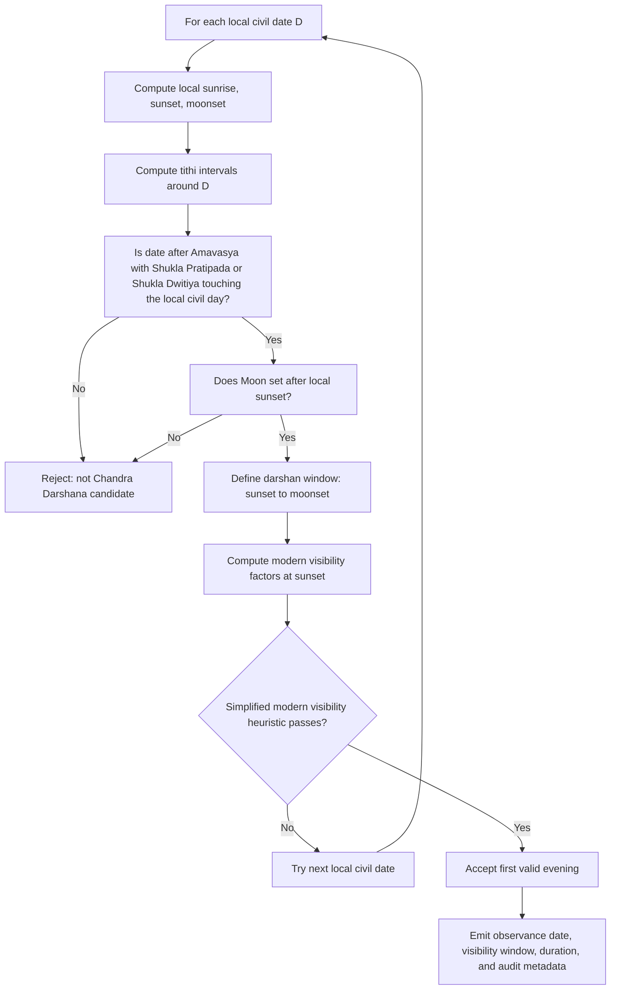

# Chandra Darshana Decision Tree

This document records the rule model used for Chandra Darshana in this package.
It intentionally separates:

- **Traditional/Panchang rule**: first visible waxing crescent after Amavasya, after local sunset.
- **Modern astronomical heuristic**: a practical visibility estimate used only to predict whether the crescent is likely visible.

The numerical visibility thresholds are **not classical shastra rules** and should not be described as shloka-based.

## Source Classification

| Layer | Rule / condition | Source type | Confidence |
|---|---|---:|---:|
| Core observance | First sighting of the Moon after Amavasya | Common Panchang / vrata practice | High |
| Core time window | After local sunset, before moonset | Common Panchang practice; Drik Panchang description | High |
| Locality | Date and timing depend on observer location | Panchang construction principle | High |
| Tithi context | Usually Shukla Pratipada or Shukla Dwitiya | Practical Panchang rule inferred from monthly Chandra Darshana listings and lunar sequence | Medium-High |
| Tithi assignment / viddha | Do not collapse post-Amavasya Pratipada observance back into Amavasya; resolve spanning tithis with Dharma Sindhu / Nirnaya Sindhu style tithi-nirnaya | Classical tithi-vrata nirnaya source family | Medium-High |
| Sectarian Vaishnava / Pushtimarg refinement | Resolve tithi conflicts and utsava scheduling by Utsava-Nirnaya / living Utsav Tippani where that tradition profile is active | Sectarian nirnaya tradition | Medium |
| Fasting/ritual | Fast may be broken after sighting and offering worship/arghya | Common vrata practice | Medium |
| Visibility prediction | Lag, elongation, illumination, crescent width/arc-of-vision style criteria | Modern astronomy, not classical Hindu text | Medium |

## Classical vs Modern Layers

### Traditional / Shastric Rule

High-confidence traditional rule:

- Chandra Darshana is the first sighting of the waxing crescent after Amavasya.
- It is observed after local sunset and before local moonset.
- The relevant tithi context is normally Shukla Pratipada or Shukla Dwitiya.
- If tithi boundaries span civil days, the tithi assignment belongs to the broader Dharma Sindhu / Nirnaya Sindhu tithi-vrata nirnaya family.

Important classical point: the post-Amavasya observance should remain tied to Pratipada/Dwitiya context. A carry-over or overlap of Amavasya is not itself Chandra Darshana.

### Pushtimarg / Vaishnava Nirnaya Layer

Pushtimarg sources do not appear to preserve Chandra Darshana as a major standalone utsava in the same way as Janmashtami, Holi, Annakut, or lineage Patotsavs. However, if a Pushtimarg or Vaishnava tradition profile is later added for Chandra Darshana, tithi-conflict handling should be documented against the sectarian nirnaya framework:

- **Utsava-Nirnaya** of Shri Vitthalnathji / Gusainji: festival and tithi-vedha resolution framework for Pushtimarg observances.
- **Bhakti-Hamsa** of Shri Vitthalnathji: vrata conduct and grahana-related timing context.
- **Tattvartha-Dipa-Nibandha - Sarva-Nirnaya Prakarana** of Vallabhacharya: philosophical nirnaya foundation for resolving religious-duty conflicts.
- **Utsav Tippani / Varsha Tippani**: living annual operational calendar applying lineage nirnaya in temple/seva practice.

These sources are relevant to conflict resolution and observance scheduling, not to numeric crescent-visibility thresholds.

### Modern Astronomical Helper

The package's `simplified_modern_crescent_visibility` model is not classical. It is a prediction aid for likely practical sighting. It uses:

- sunset-to-moonset lag
- Moon-Sun elongation at sunset
- illuminated fraction at sunset

The package labels this layer as:

```php
'chandra_darshana_visibility_basis' => 'modern_astronomical_heuristic_not_classical',
```

## Important Non-Source Note

No verified classical Hindu shloka was found that states numeric rules such as:

- minimum lag after sunset = `38 minutes`
- minimum elongation = `9 degrees`
- hard elongation floor = `7 degrees`
- minimum illumination = `0.8%`

These values are implementation heuristics inspired by modern lunar crescent visibility literature. They must remain labeled as:

```php
'chandra_darshana_visibility_model' => 'simplified_modern_crescent_visibility',
'chandra_darshana_visibility_basis' => 'modern_astronomical_heuristic_not_classical',
```

## Practical Decision Tree



## Plain-Text Decision Tree

```text
For each local civil date D:

1. Compute local astronomical anchors:
   - sunrise(D)
   - sunset(D)
   - moonset(D)
   - next sunrise(D)

2. Compute lunar context:
   - tithi active at sunrise
   - tithi transition windows
   - whether Shukla Pratipada or Shukla Dwitiya touches the local civil day
   - whether Amavasya carry-over/viddha creates a boundary case

3. Reject immediately if:
   - date is Amavasya or Krishna Paksha
   - Shukla Pratipada/Dwitiya does not touch the local civil day
   - moonset is missing
   - moonset <= sunset

4. Define the possible darshan window:
   - start = local sunset
   - end = local moonset
   - duration = moonset - sunset

5. Compute simplified modern visibility factors:
   - lag_minutes = (moonset - sunset) in minutes
   - elongation_degrees = Moon-Sun angular separation at sunset
   - illumination_percent = illuminated lunar fraction at sunset

6. Apply modern heuristic:
   - lag_minutes >= configured minimum lag
   - elongation_degrees >= hard elongation floor
   - and either:
     - elongation_degrees >= configured practical elongation minimum
     - or illumination_percent >= configured practical illumination minimum

7. If the modern heuristic fails:
   - reject this evening
   - evaluate the next local evening

8. If the modern heuristic passes:
   - accept this as Chandra Darshana
   - stop, because Chandra Darshana is the first valid visible evening

9. If multiple tradition modes are later supported:
   - generic mode: use the first visible Pratipada/Dwitiya evening
   - Dharma/Nirnaya mode: annotate the tithi-viddha decision
   - Pushtimarg mode: resolve tithi conflict through Utsava-Nirnaya-style tradition rules

10. Emit:
   - observance_date
   - visibility_window.start / end
   - start_iso / end_iso
   - duration_seconds
   - duration_minutes
   - duration_min
   - visibility_assessment audit data
```

## Current Heuristic Fields

```php
'chandra_darshana_visibility_model' => 'simplified_modern_crescent_visibility',
'chandra_darshana_visibility_min_lag_minutes' => 38,
'chandra_darshana_visibility_min_elongation_degrees' => 9.0,
'chandra_darshana_visibility_hard_elongation_floor_degrees' => 7.0,
'chandra_darshana_visibility_min_illumination_percent' => 0.8,
'chandra_darshana_visibility_basis' => 'modern_astronomical_heuristic_not_classical',
```

### Field Meanings

| Field | Meaning | Classical? |
|---|---|---:|
| `chandra_darshana_visibility_model` | Names the simplified predictor used by the package | No |
| `chandra_darshana_visibility_min_lag_minutes` | Minimum sunset-to-moonset time used for likely practical sighting | No |
| `chandra_darshana_visibility_min_elongation_degrees` | Practical Moon-Sun separation target | No |
| `chandra_darshana_visibility_hard_elongation_floor_degrees` | Lower floor inspired by the Danjon-limit family of criteria | No |
| `chandra_darshana_visibility_min_illumination_percent` | Minimum illuminated lunar fraction used by this simplified model | No |
| `chandra_darshana_visibility_basis` | Explicit warning that the rule is modern and heuristic | No |

## Visibility Assessment Output

Accepted Chandra Darshana results should expose a `visibility_assessment` object similar to:

```json
{
  "model": "simplified_modern_crescent_visibility",
  "visible": true,
  "lag_minutes": 53.3,
  "elongation_degrees": 10.67,
  "illumination_percent": 0.86,
  "min_lag_minutes": 38,
  "min_elongation_degrees": 9,
  "hard_elongation_floor_degrees": 7,
  "min_illumination_percent": 0.8,
  "passes_lag": true,
  "passes_elongation": true,
  "passes_hard_elongation_floor": true,
  "passes_illumination": true,
  "basis": "modern_astronomical_heuristic_not_classical"
}
```

## Why This Is Not Full Yallop/Odeh

This package currently uses longitude-derived elongation and illumination plus moonset lag.
Full modern crescent-visibility models need additional topocentric quantities, including:

- Moon altitude at best observation time
- Sun altitude / twilight depth
- relative azimuth
- arc of vision
- crescent width
- observer altitude and atmospheric conditions
- optical aid vs naked-eye mode

Yallop and Odeh models are better references for a future full implementation, but the current package model is intentionally named `simplified_modern_crescent_visibility`.

## Source Notes

- Drik Panchang describes Chandra Darshana as the first moon sighting after Amavasya, visible briefly after sunset before moonset.  
  <https://www.drikpanchang.com/vrats/chandra-darshan-dates.html>
- Dharma Sindhu / Nirnaya Sindhu source family: relevant for tithi-vrata nirnaya, viddha tithi handling, and avoiding wrong assignment of post-Amavasya Pratipada observances back to Amavasya. This package treats these as source-family guidance unless a specific critical edition passage is linked in a future citation note.
- Pushtimarg source family: Utsava-Nirnaya, Bhakti-Hamsa, Tattvartha-Dipa-Nibandha - Sarva-Nirnaya Prakarana, and Utsav Tippani / Varsha Tippani are relevant for sectarian tithi-conflict handling and seva calendar practice, not for numeric crescent visibility.
- USNO explains that the first lunar crescent is difficult close to New Moon and varies by location, sky, and observer conditions.  
  <https://aa.usno.navy.mil/faq/crescent>
- B. D. Yallop, *A Method for Predicting the First Sighting of the New Crescent Moon*, HM Nautical Almanac Office Technical Note 69.  
  <https://astronomycenter.net/pdf/yallop_1997.pdf>
- M. S. Odeh, *New Criterion for Lunar Crescent Visibility*, uses topocentric arc of vision and crescent width.  
  <https://astronomycenter.net/pdf/2006_cri.pdf>
- Danjon-limit literature is the basis for treating very small elongations as extremely difficult or impossible for crescent sighting. Values differ by study, so this package uses the floor only as a heuristic warning threshold.

## Future Full-Model Upgrade

A better future implementation would add a dedicated `CrescentVisibilityCalculator` with modes such as:

```php
'visibility_model' => 'yallop_q',
'visibility_model' => 'odeh_arcv_width',
'visibility_model' => 'simple_lag_elongation',
```

That calculator should return a graded result:

```text
easily_visible
visible_under_perfect_conditions
optical_aid_needed
not_visible
```

Until then, Chandra Darshana output should clearly say that its visibility decision is a modern heuristic, not a classical textual rule.
