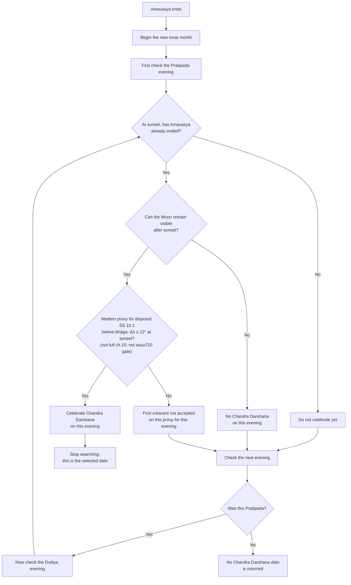

# Chandra Darshana Decision Tree

This document describes the production resolver for `Chandra Darshana` and
`Adhika Chandra Darshana`, implemented in
`src/Festivals/FestivalRuleChandraDarshana.php`.

The resolver is a source-sensitive monthly first-crescent model. It does not use
the older monthly "Sud 1 if Pratipada is short, otherwise Sud 2" selector, and
it does not use modern 38-minute / 7-degree / 9-degree / 0.8% crescent
thresholds.

## Source Boundary

The critical limitation is part of the algorithm:

> None of the source traditions used here explicitly gives a complete universal
> monthly rule saying "observe Chandra Darshana on Shukla Pratipada in condition
> X, otherwise on Dvitiya."

Production therefore keeps two layers separate:

| Layer | Result |
|---|---|
| Strict source-only | `MONTHLY_DATE_TEXTUALLY_UNDETERMINED` |
| Operational calendar | Within the Shukla Pratipada-Dvitiya field only, select the earliest post-Amavasya local evening that passes the engine's modern proxy for the traditional 12-bhaga first-crescent indication |

The public date is an application definition, not a claim that the sources state
a universal monthly date-selection command.

## Sanskrit Witnesses

### Surya Siddhanta 10.1-10.5 (philologically constrained)

The astronomical layer cites the traditional twelve-bhāga crescent indication
in SS 10.1, but production **does not** claim a full Siddhāntic chapter 10
recomputation. Three classical errors of computational retrojection are
explicitly avoided:

1. **Dogmatic resolution of textual ambiguity** — SS 10.1 alone does not settle
   whether `bhāga` is an ecliptic spatial arc or an ascensional time-degree.
2. **Fabrication of an unstated gate** — SS 10.2–10.4 do **not** state
   `final_asu ≥ 720` as a visibility boolean; production does not invent one.
3. **Proxies labeled as full recomputation** — modern Δλ and rise/set windows
   are proxies; exact dṛkkarma and lagnāntarāsavaḥ tables are unimplemented.

```text
उदयास्तविधिः प्राग्वत् कर्तव्यः शीतगोरपि ।
भागैर्द्वादशभिः पश्चाद्दृश्यः प्राग्यात्यदृश्यताम् ॥ १०.१ ॥

रवीन्द्वोः षड्भयुतयोः प्राग्वल्लग्नान्तरासवः ।
एकराशौ रवीन्द्वोश्च कार्या विवरलिप्तिकाः ॥ १०.२ ॥

तन्नाडिकाहते भुक्ती रवीन्द्वोः षष्टिभाजिते ।
तत्फलान्वितयोर्भूयः कर्तव्या विवरासवः ॥ १०.३ ॥

एवं यावत् स्थिरीभूता रवीन्द्वोरन्तरासवः ।
तैः प्राणैरस्तमेतीन्दुः शुक्लेऽर्कास्तमयात् परम् ॥ १०.४ ॥

भगणार्धं रवेर्दत्त्वा कार्यास्तद्विवरासवः ।
तैः प्राणैः कृष्णपक्षे तु शीतांशुरुदयं व्रजेत् ॥ १०.५ ॥
```

#### Status of the twelve-bhāga rule (SS 10.1)

```text
                         12 bhāga (SS 10.1)
                                │
         ┌──────────────────────┴──────────────────────┐
         ▼                                             ▼
Reading A: Ecliptic angular separation       Reading B: Oblique ascensional time
(Δλ ≥ 12° spatial arc)                       (12 time-degrees = 48 min = 720 asu)
• Supported by 10.2 angular terminology      • Supported by Burgess-style commentary
  (rāśi, vivara-liptikā)                     • Supported by 10.2–10.4 focus on
• Stated in ecliptic units (bhāga)             lagnāntara / asu calculations
```

Scholarly resolution: **textually disputed**. Software must not treat either
reading as the sole “settled” meaning of 10.1.

#### What SS 10.2–10.4 actually compute

Verses 10.2–10.4 prescribe an **iterated** local setting/rising interval in
*asu/prāṇa* (`sthirībhūtā` convergence) after a 180° (`ṣaḍbha`) shift to the
descendant horizon. Their output statement is the converged prāṇa interval for
moonset after sunset in the bright fortnight — **not** an extra
`final_asu ≥ 720` acceptance gate.

Exact classical steps require:

- table-based **dṛkkarma** (SS 2.57, 7.9, 7.11; not simplified modern β·sinλ·tanε proxies),
- latitude-dependent **lagnāntarāsavaḥ** via rāśimāna / cara (not flat `Δλ × 60`).

Production implements **neither** exact layer.

#### Standardized production metadata (scholarly-safe)

```text
surya_siddhanta_basis = [SS_10_1, SS_10_2, SS_10_3, SS_10_4, SS_10_5, SS_2_57, SS_7_9, SS_7_11]
twelve_bhaga_interpretation = textually_disputed_between_angular_arc_and_ascensional_time
angular_separation_reading_supported = true
ascensional_time_reading_supported = true
modern_proxy = directed_moon_sun_ecliptic_longitude_separation_at_local_sunset
modern_proxy_threshold_degrees = 12.0
classical_computed_output = iterated_local_setting_or_rising_interval_in_asu_prana
classical_visibility_threshold_in_asu = null
fabricated_final_asu_720_gate = false
exact_drikkarma_implemented = false
exact_oblique_ascension_implemented = false
claims_full_surya_siddhanta_recomputation = false
claims_full_surya_siddhanta_chapter_10_recomputation = false

astronomical_basis = modern_ecliptic_longitude_proxy_for_surya_siddhanta_12_bhaga_indication
modern_proxy_for_surya_siddhanta_12_bhaga_indication = true
modern_directed_moon_sun_longitude_separation_at_local_sunset_degrees = ...
modern_longitude_separation_normalization = zero_to_360_directed_moon_minus_sun
visibility_proxy_requires_waxing_half = true
surya_siddhanta_oblique_ascensional_interval_computed = false
```

**Defensible summary:**

1. SS 10.1 supplies a traditional twelve-bhāga lunar visibility *indication*,
   disputed between ecliptic arc and ascensional time (720 asu).
2. SS 10.2–10.4 prescribe iterated asu/prāṇa setting intervals; they do **not**
   declare `final_asu ≥ 720` as a secondary boolean.
3. Production’s `Δλ ≥ 12°` at local sunset is a **practical modern proxy**
   (Reading-A-style operationalization). It does not reproduce full chapter 10
   horizon mechanics.

Local sunset is the application evaluation epoch for this proxy:

```text
application_evaluation_epoch = local_sunset
evaluation_epoch_is_explicitly_commanded_by_surya_siddhanta_10_1 = false
```

Moonset lag and illuminated fraction are diagnostic metadata only. They are not
used as classical rejection thresholds.

### Nirnayamrita, Smriti-vacana, and Variant Attribution

The tithi visibility indication is a contextual nibandha rule, not a universal
monthly command.

Nirnayamrita prose decision:

```text
प्रतिपद्यपराह्णिकत्रिमुहूर्तव्यापिन्यां द्वितीयायां
चन्द्रदर्शनं सम्भाव्यते ।
```

Transmitted metrical rule, commonly connected with Anvadhana/Darsha ritual:

```text
द्वितीया त्रिमुहूर्ता चेत् प्रतिपद्यापराह्णिकी ।
अन्वाधानं चतुर्दश्यां परतः सोमदर्शनात् ॥
```

Some later witnesses transmit a variant with `अग्न्याधानं` instead of
`अन्वाधानं`, and attribution varies between Vriddha-Satatapa and Baudhayana in
later nibandha literature. Production therefore labels this layer as:

```text
tithi_corroboration_basis = nibandha_tithi_visibility_indication
tithi_indication_original_context = darsa_anvadhana_and_govardhana_adjudication
tithi_indication_monthly_use = application_level_analogy
source_attested_tithi_scope = SHUKLA_PRATIPADA_DVITIYA_TRANSITION
operational_candidate_scope = SHUKLA_PRATIPADA_AND_SHUKLA_DVITIYA_ONLY
search_beyond_dvitiya = false
```

The indication is one-way:

```text
Dvitiya covers the full Aparahna interval -> traditional possibility of Moon sighting is indicated
```

It does not imply:

```text
Dvitiya does not cover Aparahna -> Moon sighting is impossible
```

### Viramitrodaya Parallel Witness

Viramitrodaya is relevant as a later parallel interpretive witness because it
uses substantially the same verse in a ritual timing discussion. Its online
transmission may contain OCR/textual damage, so the normalized form is documented
as a witness, not as an independently settled original:

```text
अपराह्णसन्धौ तावत्परेद्युश्चन्द्रदर्शनाभावे सन्धिदिनेऽन्वाधानं प्रातर्यागः ।

द्वितीया त्रिमुहूर्ता चेत् प्रतिपद्यापराह्णिकी ।
अन्वाधानं चतुर्दश्यां परतः सोमदर्शनात् ॥
```

The attribution apparatus is therefore:

```text
Nirnayamrita witness      -> Vriddha-Satatapa attribution
Viramitrodaya witness     -> Baudhayana attribution
Production source status  -> later nibandha/smriti-vacana transmission
```

This witness supports the possibility-of-Moon-sighting inference, but still does
not create a universal monthly Chandra Darshana date command.

### Dharma Sindhu Time Divisions

The fivefold daylight division used for Aparahna is:

```text
तत्र दिनं पञ्चधा विभज्य प्रथमभागः प्रातःकालो ज्ञेयः,
द्वितीयः सङ्गवः, तृतीयो मध्याह्नः, चतुर्थो भागोऽपराह्णः,
पञ्चमः सायाह्नः ।
```

The Pradosha definition used for overlap metadata is:

```text
सूर्यास्तोत्तरं त्रिमुहूर्तं प्रदोषः ।
```

Production uses a dynamic night-muhurta convention for this overlap:

```text
pradosha_muhurta_basis = dynamic_ratrimana_muhurta
```

Pradosha overlap is never a rejection rule for monthly Chandra Darshana.

### Shabdakalpadruma / Hari-bhakti-vilasa Transmission

The lexicographical / Vaishnava transmission preserves the same inference. This
is useful as a documentary witness, but it is not counted as three independent
ancient authorities:

```text
तदुदयसम्भावनञ्च निर्णयामृते निर्णीतम् ।
प्रतिपद्यापराह्णिकत्रिमुहूर्त्तव्यापिन्यां द्वितीयायां चन्द्रदर्शनं सम्भाव्यते ।

तदुक्तमग्न्याधानविषये वृद्धशातातपेन ।

द्वितीया त्रिमुहूर्त्ता चेत् प्रतिपद्यापराह्णिकी ।
अग्न्याधानं चतुर्द्दश्यां परतः सोमदर्शनात् ॥

अपराह्णश्च पञ्चधाविभक्तस्याह्नश्चतुर्थो भागः ।

ततश्च यत्र प्रतिपदि षण्मुहूर्त्तव्यापिनी द्वितीया तत्र चन्द्रदर्शनसम्भावनम् ।
```

Production treats `अग्न्याधानं` here as a variant against the stronger
`अन्वाधानं` ritual context.

### Skanda Purana Govardhana Witness

Skanda Purana gives direct authority for the Govardhana / Gokrida moon-visibility
concern:

```text
बलिपूजां विधायैवं पश्चाद्गोक्रीडनं चरेत् ।
गवां क्रीडादिने यत्र रात्रौ दृश्येत चन्द्रमाः ।
सोमो राजा पशून्हन्ति सुरभीपूजकांस्तथा ॥
```

This belongs to Govardhana / Gokrida. It is not imported into the generic
monthly Chandra Darshana selector. Govardhana / Annakut keeps its own separate
Pratipada conflict logic from Satsangi Jeevan / Dharma Sindhu:

- Satsangi Jeevan requires Kartika Shukla Pratipada to be `sayahna-vyapini`
  for Govardhan Utsav and says Annakut is offered at `madhyahna`.
- Dharma Sindhu says that when the sunrise Pratipada lasts 10 daytime muhurtas,
  all Pratipada rites are done on that later Pratipada day.
- If even 9 daytime muhurtas of sunrise Pratipada are not available, the
  Govardhan/Gokrida/Bali group falls back to the previous Amavasya-viddha
  Pratipada day.
- The 6-muhurta Dvitiya-entry statement explains the gross moon-visibility
  concern; it is not a standalone monthly Chandra Darshana selector.

### Optional Surya Siddhanta Astronomy Apparatus

These verses are relevant only if a future implementation reproduces a fuller
Siddhantic astronomy layer. The current production resolver does not use them as
religious date-selection rules.

Lunar latitude / viksepa:

```text
स्वपातोनाद्ग्रहाज्जीवा शीघ्राद्भृगुजसौम्ययोः ।
विक्षेपघ्न्यन्त्यकर्णाप्ता विक्षेपस्त्रिज्यया विधोः ॥ २.५७ ॥
```

Drkkarma passage, with a documented textual concern around 7.9:

```text
लब्धं प्राच्यां ऋणं सौम्याद्विक्षेपात् पश्चिमे धनम् ।
दक्षिणे प्राक्कपाले स्वं पश्चिमे तु विपर्ययः ॥ ७.९ ॥

नक्षत्रग्रहयोगेषु ग्रहास्तोदयसाधने ।
शृङ्गोन्नतौ तु चन्द्रस्य दृक्कर्मादाविदं स्मृतम् ॥ ७.११ ॥
```

Some digital witnesses read a damaged form near the end of 7.9. Documentation
must not quote that line as critically settled without an apparatus.

## Authenticated Corpus Summary

| Status | Source | Production role |
|---|---|---|
| Include | Surya Siddhanta 10.1-10.5 | Traditional crescent visibility / moon-setting witness; implemented only as a modern 12-degree proxy |
| Include as prose | Nirnayamrita | Dvitiya full-Aparahna Moon-sighting possibility |
| Include with apparatus | Smriti-vacana | `द्वितीया त्रिमुहूर्ता... अन्वाधानं...` ritual inference |
| Mention disputed attribution | Nirnayamrita / Viramitrodaya | Vriddha-Satatapa versus Baudhayana witness labels |
| Include as definition | Dharma Sindhu | Fivefold daytime division and Pradosha interval |
| Include | Skanda Purana 2.4.10.59-61 | Direct Govardhana / Gokrida moon-visibility authority |
| Secondary witness | Hari-bhakti-vilasa / Shabdakalpadruma / Vachaspatyam | Transmission of the prose and smriti-vacana material |
| Optional appendix | Surya Siddhanta 2.57 and 7.9-7.11 | Astronomy apparatus only; not observance selector |

## Catalog Rules

| Festival | Production flags |
|---|---|
| `Chandra Darshana` | `chandra_darshana_visibility: true`, `karmakala_type: chandra_darshana_visibility`, `chandra_darshana_visibility_model: source_sensitive_monthly_chandra_darshana_first_crescent`, `chandra_darshana_visibility_basis: application_definition_first_visible_crescent` |
| `Adhika Chandra Darshana` | Same resolver, plus `adhika_only: true` |

There is no monthly `chandra_darshana_sthula_muhurta_threshold` catalog field.

## Season Reconstruction

The resolver needs historical snapshots. If either the transit engine or the
historical snapshot callback is unavailable, monthly Chandra Darshana returns no
candidate instead of falling back to the retired rule.

For each civil date, production searches back up to eight days and reconstructs
the current lunation from:

- an Amavasya snapshot with `tithi_index_abs == 30` and `tithi_end_jd`, or
- a Pratipada snapshot with `tithi_index_abs == 1` and `tithi_start_jd`.

The latest Amavasya end before the current sunset is used as the season anchor.

## Evening Evaluation

Only Shukla Pratipada and Shukla Dvitiya evenings are candidate evenings. They
are evaluated chronologically.

## Production Decision Tree

This tree intentionally shows only the operational path from Amavasya to the
monthly Chandra Darshana date, in decision-maker language. It is still a
lossless map of the production date selector in
`FestivalRuleChandraDarshana.php`: after Amavasya ends, the resolver checks
Pratipada first and Dvitiya second. It selects the first of those two evenings
where the Moon can be treated as the first visible crescent by the engine model.
If both fail, production returns no monthly Chandra Darshana date for that
lunation instead of falling through to Tritiya or later.

The Dvitiya-Aparahna nibandha indication, six-muhurta indication, Pradosha
overlap, strict-source boundary, and diagnostic fields are still computed by
production, but they are evidence attached to the chosen evening. They do not
move the date away from the first passing Pratipada/Dvitiya evening.



In simple words: after Amavasya, the resolver first tries the Pratipada evening.
If the Moon cannot remain visible after sunset, or if the first-crescent
12-degree check does not pass, the resolver does not celebrate on Pratipada and
tries the Dvitiya evening. If Dvitiya also fails, production returns no Chandra
Darshana date for that lunation. It does not continue to Tritiya, Chaturthi,
Panchami, or later tithis.

The Dvitiya Aparahna rule and Pradosha overlap travel with the result as
evidence, but neither can replace the first passing Pratipada/Dvitiya evening.

### Horizon Window

The current production horizon gate is a rise/set proxy:

```text
moonrise < sunset < moonset
```

The window is:

```text
sunset -> moonset
```

This is recorded as `method = rise_set_window_proxy`. It is not yet an apparent
upper-limb altitude and next-set search. The field proves a post-sunset horizon
window, not actual naked-eye observation.

### 12-Bhaga Proxy

Production computes:

```text
modern_directed_moon_sun_longitude_separation_at_local_sunset_degrees
```

from `moon_sun_elongation_at_sunset_degrees`. Despite the legacy field name,
that source value is already the directed Moon-minus-Sun ecliptic-longitude
separation normalized to `0..360`, not modern great-circle elongation.

```text
separation < 12.0              -> TWELVE_BHAGA_PROXY_NOT_PASSED
12.0 <= separation < 180.0     -> TWELVE_BHAGA_PROXY_PASSED
separation >= 180.0            -> TWELVE_BHAGA_PROXY_NOT_PASSED
```

This is intentionally named as a modern proxy. It must not be presented as a
full Surya Siddhanta chapter 10 recomputation, the chapter's local oblique
ascensional interval, or modern apparent great-circle elongation.

### Dvitiya Aparahna Indication

The tithi indication is checked only when Pratipada is active at sunrise.

Production divides local daylight dynamically:

```text
daylight = sunset - sunrise
day_muhurta = daylight / 15
aparahna_start = sunrise + 9 * day_muhurta
aparahna_end   = sunrise + 12 * day_muhurta
```

The literal three-Aparahna-muhurta condition is:

```text
dvitiya_start <= aparahna_start
AND
dvitiya_end   >= aparahna_end
```

The stronger six-muhurta explanatory condition is stored independently:

```text
dvitiya_start <= aparahna_start
AND
dvitiya_end   >= sunset
```

Production computes the actual Dvitiya end with the transit engine. It does not
turn `Pratipada < 9 muhurtas`, `Pratipada >= 10 muhurtas`, or Dvitiya-entry
thresholds into monthly Chandra Darshana rules. Those thresholds belong only to
the Govardhan/Gokrida/Bali Pratipada adjudication context.

## Orthogonal Evidence Fields

Each evening stores independent evidence blocks. These facts can overlap and
must not be treated as a single mutually exclusive truth source:

```json
{
  "horizon": {
    "status": "POST_SUNSET_HORIZON_WINDOW",
    "method": "rise_set_window_proxy"
  },
  "surya_siddhanta_visibility": {
    "status": "TWELVE_BHAGA_PROXY_PASSED",
    "method": "modern_directed_ecliptic_longitude_separation_proxy",
    "claims_exact_siddhantic_recomputation": false
  },
  "nibandha_tithi_indication": {
    "status": "FULL_APARAHNA_INDICATION_NOT_ESTABLISHED",
    "original_context": "darsa_anvadhana_and_govardhana_adjudication",
    "monthly_use": "application_level_analogy"
  },
  "stronger_six_muhurta_indication": {
    "status": "SIX_MUHURTA_INTERVAL_NOT_COVERED"
  },
  "pradosha": {
    "status": "PRADOSHA_OVERLAP_PRESENT",
    "used_as_rejection_rule": false
  },
  "monthly_observance": {
    "strict_source_only_status": "MONTHLY_DATE_TEXTUALLY_UNDETERMINED",
    "application_status": "APPLICATION_FIRST_CRESCENT_CANDIDATE"
  }
}
```

The top-level `classification` / `summary_classification` remains only a summary
label for display and testing:

| Summary classification | Meaning |
|---|---|
| `APPLICATION_CRESCENT_CANDIDATE_WITH_NIBANDHA_INDICATION` | Horizon window exists, the 12-degree proxy passes, and Dvitiya covers the full three Aparahna muhurtas |
| `APPLICATION_CRESCENT_CANDIDATE` | Horizon window exists and the 12-degree proxy passes; tithi indication is false, unavailable, or inapplicable |
| `NIBANDHA_TITHI_INDICATION_ASTRONOMICAL_PROXY_DIVERGENCE` | Dvitiya covers the full Aparahna interval, but the horizon/proxy branch does not pass |
| `NO_POST_SUNSET_HORIZON_WINDOW` | `moonrise < sunset < moonset` is false |
| `TWELVE_BHAGA_PROXY_NOT_PASSED` | Horizon window exists, but the 12-degree proxy does not pass |

Within the Shukla Pratipada-Dvitiya scope, the operational selector accepts the
first chronological evening where:

```text
horizon.status = POST_SUNSET_HORIZON_WINDOW
AND
surya_siddhanta_visibility.status = TWELVE_BHAGA_PROXY_PASSED
```

The Dvitiya indication is attached as metadata. It never displaces an earlier
astronomical-proxy candidate, and it does not create a Tritiya fallback.

## Output Fields

The decision payload includes:

```json
{
  "visibility_assessment": {
    "model": "source_sensitive_monthly_chandra_darshana_first_crescent",
    "operational_candidate": true,
    "geometrically_supported_by_engine_proxy": true,
    "actual_observation": "UNKNOWN",
    "classification": "APPLICATION_CRESCENT_CANDIDATE",
    "summary_classification": "APPLICATION_CRESCENT_CANDIDATE",
    "strict_source_only_result": "MONTHLY_DATE_TEXTUALLY_UNDETERMINED",
    "date_selection_basis": "application_definition_first_visible_crescent",
    "source_attested_tithi_scope": "SHUKLA_PRATIPADA_DVITIYA_TRANSITION",
    "operational_candidate_scope": "SHUKLA_PRATIPADA_AND_SHUKLA_DVITIYA_ONLY",
    "search_beyond_dvitiya": false,
    "astronomical_basis": "modern_ecliptic_longitude_proxy_for_surya_siddhanta_12_bhaga_indication",
    "astronomical_computation_basis": "directed_moon_minus_sun_ecliptic_longitude_separation_at_local_sunset_checked_against_12_degree_proxy_threshold",
    "application_evaluation_epoch": "local_sunset",
    "modern_proxy_for_surya_siddhanta_12_bhaga_rule": true,
    "modern_proxy_for_surya_siddhanta_12_bhaga_indication": true,
    "claims_full_surya_siddhanta_chapter_10_recomputation": false,
    "claims_modern_great_circle_elongation": false,
    "tithi_corroboration_basis": "nibandha_tithi_visibility_indication",
    "tithi_indication_original_context": "darsa_anvadhana_and_govardhana_adjudication",
    "tithi_indication_monthly_use": "application_level_analogy",
    "pradosha_basis": "satsangijivan_childhood_samskara_analogy_only",
    "pradosha_muhurta_basis": "dynamic_ratrimana_muhurta",
    "modern_directed_moon_sun_longitude_separation_at_local_sunset_degrees": 12.0,
    "modern_longitude_separation_normalization": "zero_to_360_directed_moon_minus_sun",
    "visibility_proxy_requires_waxing_half": true,
    "surya_siddhanta_oblique_ascensional_interval_computed": false,
    "proxy_threshold_degrees": 12.0,
    "moonset_lag_seconds": 0.0,
    "moonset_lag_minutes": 0.0,
    "illumination_percent": 0.0,
    "horizon": {},
    "surya_siddhanta_visibility": {},
    "nibandha_tithi_indication": {},
    "stronger_six_muhurta_indication": {},
    "pradosha": {},
    "monthly_observance": {},
    "forbidden_modern_thresholds_applied": false,
    "reason": "chandra_darshana_application_crescent_candidate",
    "basis": "application_definition_first_visible_crescent"
  }
}
```

## Forbidden Monthly Branches

The production monthly resolver must not contain:

- `Pratipada < 9 muhurtas -> Sud 1` / `Pratipada >= 10 muhurtas -> Sud 2`,
- kshaya-Pratipada Amavasya-day fallback,
- separate Adhika-month date-selection branch,
- one-ghati-after-sunset rule,
- 38-minute lag threshold,
- 7-degree or 9-degree elongation threshold,
- 0.8% illumination threshold,
- Dvitiya-at-sunset selector,
- requirement that the selected tithi overlap the full Moon-viewing window,
- Govardhana Moon-warning logic.

Those rules either belong to other festival truth tables or are modern diagnostic
ideas that are not part of this monthly Chandra Darshana resolver.
