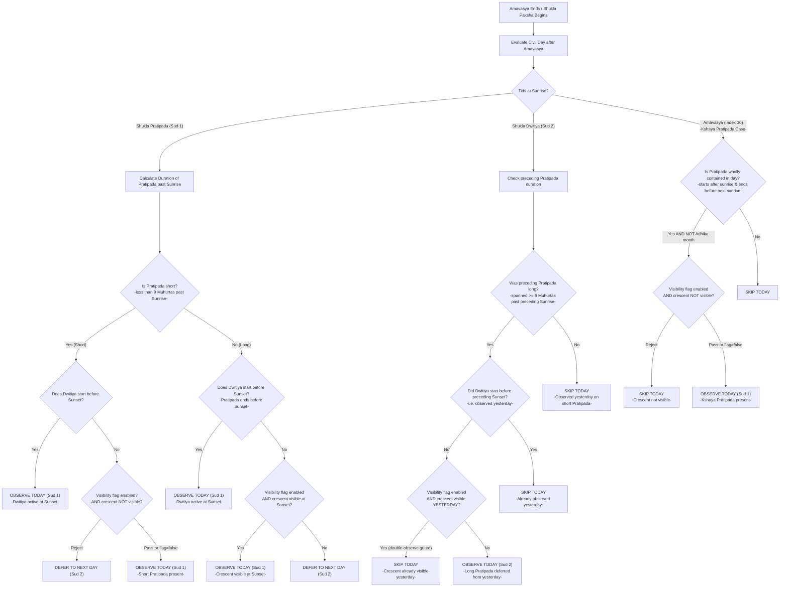

# Chandra Darshana Decision Tree

This document describes the exact decision engine logic used to resolve **Chandra Darshana** and **Adhika Chandra Darshana** in the package.

---

## 1. Classical Sthula 9-Muhurta Decision Rules

The resolution is executed once per civil date. The decision logic is branched based on the sunrise tithi index (`tithi_index_abs` in `Resolution_Context`), denoted as `currentAbs`.

### Key Parameters & Calculations

**Daylight Muhurta**

$$
\text{muhurtaSeconds} = \frac{(\text{sunsetJd} - \text{sunriseJd}) \times 86400.0}{15.0}
$$

**Sthula Threshold**

$$
\text{thresholdSeconds} = 9 \times \text{muhurtaSeconds}
$$

**Pratipada Duration past Sunrise**

$$
\text{postSunriseSeconds} = (\text{pratipadaInterval.endJd} - \text{sunriseJd}) \times 86400.0
$$

**Dwitiya Sunset Transition**

$$
\text{dwitiyaActiveAtSunset} = (\text{pratipadaInterval.endJd} < \text{sunsetJd})
$$

### Decision Logic

#### Branch A: Pratipada at Sunrise (`currentAbs === 1`)

**Step 1.** Evaluate:

$$
\text{postSunriseSeconds} < \text{thresholdSeconds} \quad \text{(Pratipada is short)} \quad \text{OR} \quad \text{dwitiyaActiveAtSunset} = \text{true}
$$

- **Case A1** (`dwitiyaActiveAtSunset` is true): Target Tithi = `2`, Reason = `chandra_darshana_dwitiya_fallback_at_local_sunset`
- **Case A2** (`dwitiyaActiveAtSunset` is false): Target Tithi = `1`, Reason = `chandra_darshana_sud1_short_pratipada_sthula_present`

**Step 2.** Else if `chandra_darshana_visibility_affects_selection` is **false** (classical): no further branches; the day is deferred to Sud 2 (handled in Branch B on the next day).

**Step 3.** Else if `chandra_darshana_visibility_affects_selection` is **true** AND `isYoungCrescentVisibleAtSunset` is true: Target Tithi = `1`, Reason = `chandra_darshana_sud1_crescent_visible_at_sunset`

**Step 4.** Else: defer to Sud 2.

> **Modern visibility gate (when flag = true):** after establishing the initial candidate via classical rules, the engine additionally requires `isYoungCrescentVisibleAtSunset` to return `true`. If it returns `false`, the candidate is rejected regardless of classical outcome.

#### Branch B: Dwitiya at Sunrise (`currentAbs === 2`)

**Step 1.** Calculate the preceding Pratipada duration:

$$
\text{postSunriseSeconds} = (\text{prevPratipadaEndJd} - \text{prevSunriseJd}) \times 86400.0
$$

**Step 2.** Calculate the preceding sunset time:

$$
\text{prevSunsetJd} = \text{prevSunriseJd} + (\text{sunsetJd} - \text{sunriseJd})
$$

**Step 3.** Check duplicate prevention:

$$
\text{dwitiyaStartedBeforePrevSunset} = (\text{prevSunsetJd} > 0.0 \quad \text{AND} \quad \text{prevPratipadaEndJd} < \text{prevSunsetJd})
$$

**Step 4.** Evaluate:

$$
\text{postSunriseSeconds} \ge \text{thresholdSeconds} \quad \text{(preceding Pratipada was long)} \quad \text{AND} \quad \text{NOT dwitiyaStartedBeforePrevSunset}
$$

- If true: Target Tithi = `2`, Reason = `chandra_darshana_sud2_long_pratipada_no_sthula_on_sud1`

**Step 5.** When `chandra_darshana_visibility_affects_selection` is **true**: additionally requires `isYoungCrescentVisibleAtYesterdaySunset` to return `false` (i.e. crescent was NOT visible yesterday). If the crescent was already visible at yesterday's sunset, the Dwitiya candidate is skipped to prevent a double-observation.

#### Branch C: Kshaya Pratipada (`currentAbs === 30`)

**Step 1.** If the Shukla Pratipada interval starts after today's sunrise, ends before next sunrise, and `adhika_only` is false: Target Tithi = `1`, Reason = `chandra_darshana_sud1_kshaya_pratipada_sthula_present`

**Step 2.** When `chandra_darshana_visibility_affects_selection` is **true**: additionally requires `isYoungCrescentVisibleAtSunset` to return `true`. If the crescent is not visible, the Kshaya candidate is also rejected.

---

## 2. Decision Flowchart



---

## 3. Modern Astronomical Heuristic

`isYoungCrescentVisibleAtSunset` is **always computed** to populate `visibility_assessment.modern_visibility` metadata. When `chandra_darshana_visibility_affects_selection` is `true` it additionally acts as a **rejection gate** across all three resolution branches.

**Sunset-to-Moonset Lag**

$$
\text{lagMinutes} = (\text{moonsetJd} - \text{sunsetJd}) \times 1440.0
$$

**Elongation at Sunset**

$$
\text{elongation} = \text{moonSunElongationAtSunsetDegrees}
$$

**Illumination at Sunset**

$$
\text{illumination} = \text{moonIlluminationAtSunsetPercent}
$$

### Conditions

| # | Condition | Parameter (config key) | Default | Result |
|---|---|---|---|---|
| 1 | `lagMinutes < minLag` | `chandra_darshana_visibility_min_lag_minutes` | `38.0` | return **false** |
| 2 | `elongation < hardFloor` | `chandra_darshana_visibility_hard_elongation_floor_degrees` | `7.0` | return **false** |
| 3a | `elongation >= minElongation` | `chandra_darshana_visibility_min_elongation_degrees` | `9.0` | return **true** |
| 3b | `illumination >= minIllumination` | `chandra_darshana_visibility_min_illumination_percent` | `0.8` | return **true** |

Rule 3 is an **OR**: either 3a or 3b passing is sufficient to return `true`, provided rules 1 and 2 have not already short-circuited to `false`.

### Yesterday's Visibility Data

For the Dwitiya double-observation guard, `PanchangService` always injects the following into `Resolution_Context`:

| Key | Description |
|---|---|
| `prev_sunset_jd` | Julian Day of the preceding day's sunset |
| `prev_moonset_jd` | Julian Day of the preceding day's moonset |
| `prev_moon_sun_elongation_at_sunset_degrees` | Moon–Sun elongation at the preceding sunset |
| `prev_moon_illumination_at_sunset_percent` | Moon illumination (%) at the preceding sunset |

`isYoungCrescentVisibleAtYesterdaySunset` runs the same three-rule check against this previous-day data.

---

## 4. Flag Behaviour Summary

| `chandra_darshana_visibility_affects_selection` | Classical Sthula | Modern Visibility Gate | `modern_visibility` in output |
|---|---|---|---|
| `false` (default) | ✅ Active | ❌ Not applied | ✅ Always present (audit only) |
| `true` | ✅ Active (initial candidate) | ✅ Rejection filter on all branches | ✅ Always present (and used) |

---

## 5. Output Metadata Structure

When resolved, the festival payload includes the following structure:

```json
{
  "name": "Chandra Darshana",
  "name_key": "Chandra Darshana",
  "description": "Chandra Darshana marks the first visible crescent moon after Amavasya.",
  "deity": "Chandra",
  "fasting": true,
  "regions": ["Pan-India"],
  "aliases": [],
  "observance_note": null,
  "calculation_basis": {
    "type": "tithi",
    "type_name": "tithi",
    "basis": "chandra_darshana",
    "basis_name": "Chandra Darshana",
    "resolver": "classical",
    "chandra_darshana_visibility_model": "classical_sthula_chandra_darshana_9_muhurta",
    "chandra_darshana_visibility_model_name": "classical Sthula Chandra Darshana 9-muhurta rule",
    "chandra_darshana_visibility_min_lag_minutes": 38,
    "chandra_darshana_visibility_min_elongation_degrees": 9,
    "chandra_darshana_visibility_hard_elongation_floor_degrees": 7,
    "chandra_darshana_visibility_min_illumination_percent": 0.8,
    "chandra_darshana_visibility_basis": "classical_textual_rule_sthula_chandra_darshana",
    "chandra_darshana_visibility_basis_name": "classical textual rule (Sthula Chandra Darshana Sud 1 or Sud 2)"
  },
  "rules_applied": {
    "strict_karmakala": true,
    "require_karmakala_match": true,
    "winning_reason": "Pratipada active at local sunset",
    "winning_reason_key": "chandra_darshana_pratipada_at_local_sunset",
    "winning_reason_name": "Pratipada active at local sunset",
    "winning_score": 1500,
    "winning_window_overlap_seconds": 1990.0,
    "winning_window_coverage_ratio": 1.0,
    "target_tithi_daylight_overlap_seconds": 14922.1,
    "moon_visibility_start_jd": 2461355.027,
    "moon_visibility_end_jd": 2461355.050,
    "moon_visibility_seconds": 1990.0,
    "visibility_assessment": {
      "model": "classical_sthula_chandra_darshana_9_muhurta",
      "visible": true,
      "evening_tithi": "shukla_dwitiya",
      "pratipada_post_sunrise_seconds": 25169.85,
      "pratipada_post_sunrise_minutes": 419.49,
      "pratipada_post_sunrise_muhurtas": 9.41,
      "sthula_threshold_muhurtas": 9,
      "sthula_threshold_seconds": 24055.2,
      "day_muhurta_seconds": 2672.8,
      "reason": "chandra_darshana_dwitiya_fallback_at_local_sunset",
      "basis": "classical_textual_rule_sthula_chandra_darshana",
      "modern_visibility": {
        "lag_minutes": 42.3,
        "lag_passes": true,
        "elongation_degrees": 11.2,
        "elongation_passes_hard_floor": true,
        "elongation_passes_min": true,
        "illumination_percent": 1.1,
        "illumination_passes": true,
        "crescent_visible": true,
        "affects_selection": false
      }
    }
  },
  "visibility_window": {
    "type": "moon_visibility",
    "type_name": "sunset to moonset visibility",
    "display": "06:09 PM to 06:42 PM",
    "start": "06:09 PM",
    "end": "06:42 PM",
    "start_iso": "10/11/2026 06:09:13 PM",
    "end_iso": "10/11/2026 06:42:23 PM",
    "start_jd": 2461355.027,
    "end_jd": 2461355.050,
    "duration_seconds": 1990.0,
    "duration_minutes": 33.16,
    "duration_min": "33m 10s"
  },
  "observance_window": {
    "type": "moon_visibility",
    "type_name": "sunset to moonset visibility",
    "display": "06:09 PM to 06:42 PM",
    "start": "06:09 PM",
    "end": "06:42 PM",
    "start_iso": "10/11/2026 06:09:13 PM",
    "end_iso": "10/11/2026 06:42:23 PM",
    "start_jd": 2461355.027,
    "end_jd": 2461355.050,
    "duration_seconds": 1990.0,
    "duration_minutes": 33.16,
    "duration_min": "33m 10s"
  }
}
```

### `modern_visibility` Fields

| Field | Type | Description |
|---|---|---|
| `lag_minutes` | float | Moonset minus sunset in minutes |
| `lag_passes` | bool | `true` if lag ≥ `min_lag_minutes` threshold |
| `elongation_degrees` | float | Moon–Sun elongation at sunset |
| `elongation_passes_hard_floor` | bool | `true` if elongation ≥ hard floor (7°) |
| `elongation_passes_min` | bool | `true` if elongation ≥ min threshold (9°) |
| `illumination_percent` | float | Moon illumination fraction (%) at sunset |
| `illumination_passes` | bool | `true` if illumination ≥ min threshold (0.8%) |
| `crescent_visible` | bool | Overall visibility: `true` if lag_passes AND elongation_passes_hard_floor AND (elongation_passes_min OR illumination_passes) |
| `affects_selection` | bool | Whether the gate was actually applied to the date decision (`chandra_darshana_visibility_affects_selection` value) |
