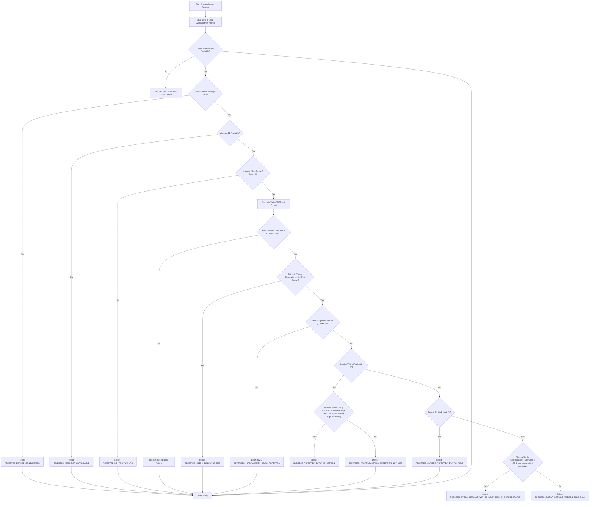

# Chandra Darshana Hybrid Resolver & Textual Specification

This document provides the complete, unified specification for the **monthly Chandra Darśana** hybrid resolution engine implemented in production within `src/Festivals/FestivalRuleChandraDarshana.php`.

**Adhika Chandra Darśana** is registered as a separate festival identity in the catalogue (`FestivalCatalog`), but this trait contains **no separate Adhika-month branch, identifier, or distinct rule**. Adhika Chandra Darśana uses the **same resolver**; distinction is only by upstream month/festival registration (Adhika lunar month context).

It combines the **modern astronomical Yallop TN69 model**, **Sūrya Siddhānta 10.1 ecliptic separation**, and the **classical Śāstric gates** (*Dharma Sindhu*, *Nirṇayāmṛta*, *Viramitrodaya*, *Śabdakalpadruma*, and *Skanda Purāṇa*).

> **Audit tooling note:** Production logic is defined by `FestivalRuleChandraDarshana.php` (and shared Yallop helpers in `scripts/lib/chandra_yallop.php`). The CLI `scripts/chandra_hybrid_scripture_modern_resolver.php` is a related experimental bulk resolver; it is **not guaranteed** to mirror the production trait until explicitly compared and updated (historically it has differed on evening-scan count and outside-Pratipadā/Dvitīyā handling). Do not treat that script as authoritative for production behavior.

---

## Table of Contents

1. [Scope & Philosophy](#scope--philosophy)
2. [Sequential Gate Table](#sequential-gate-table)
3. [Decision Tree Flowchart](#decision-tree-flowchart)
4. [Detailed Gate Mechanics](#detailed-gate-mechanics)
   - [Modern Astronomical Layer (Yallop TN69)](#1-modern-astronomical-layer-yallop-tn69)
   - [Siddhāntic Ecliptic Gate (SS 10.1)](#2-siddhāntic-ecliptic-gate-ss-101)
   - [Nirṇayāmṛta Kṣaya Pratipadā Gate](#3-nirṇayāmṛta-kṣaya-pratipadā-gate)
   - [Dharma Sindhu Disjunctive Corroboration Gates](#4-dharma-sindhu-disjunctive-corroboration-gates)
5. [Success Paths & Resolution Matrix](#success-paths--resolution-matrix)
6. [Master Sanskrit Shlokas & Textual Authority](#master-sanskrit-shlokas--textual-authority)
   - [Master Index & Production Mapping](#master-index--production-mapping)
   - [Section A: Explicit First-Crescent & Visibility Texts](#section-a-explicit-first-crescent--visibility-texts)
   - [Section B: Implicit Apparatus & Day-Division Definitions](#section-b-implicit-apparatus--day-division-definitions)
   - [Section C: Related Lunation Texts](#section-c-related-lunation-texts)
   - [Section D: Canonical Lexicon of Candra- / Soma-Darśana Phrases](#section-d-canonical-lexicon-of-candra---soma-darśana-phrases)
7. [Output Contract & Audit Tooling](#output-contract--audit-tooling)

---

## Scope & Philosophy

Chandra Darśana is the monthly observance of the first visible waxing crescent moon after *Amāvāsyā* (Solar-Lunar Conjunction). 

Because no single ancient text contains a standalone universal calendar command covering all modern edge cases, the resolver implements an **operational hybrid engine**:

1. **Modern Astronomical Precision:** Uses the **Yallop TN69 coordinate convention**: geocentric ARCL/ARCV/DAZ and topocentrically corrected crescent width ($W'$). Observer elevation appears in an audit path, not in the core $q$ decision. (Not a fully topocentric ARCL/ARCV stack.)
2. **Siddhāntic Separation Floor:** Enforces Sūrya Siddhānta 10.1 directed waxing ecliptic separation ($\Delta\lambda \ge 12.0^\circ$) at local sunset.
3. **Śāstric Edge-Case Safeguards:** Implements *Nirṇayāmṛta* Kṣaya Pratipadā Day-1 deferral and *Dharma Sindhu* Dvitīyā time-window corroborations (*Aparāhṇa* and a **six-muhūrta post-sunset Sthūla-darśana window**).

### Mandatory cumulative order

```text
post-conjunction
→ positive moonset lag
→ Yallop B
→ Danjon
→ SS 10.1 ≥ 12°
→ kṣaya deferral
→ Pratipadā/Dvitīyā day selection
```

Production constants (trait):

| Constant | Value |
|---|---|
| `CHANDRA_DARSHANA_MAX_POST_AMAVASYA_EVENINGS` | `6` |
| `CHANDRA_DARSHANA_YALLOP_MIN_CATEGORY` | `B` |
| `CHANDRA_DARSHANA_APPLY_DANJON_GUARD` | `true` (default) |
| `CHANDRA_DARSHANA_SS10_1_ECLIPTIC_MIN_DEG` | `12.0` |
| Aparāhṇa min muhūrtas | `3.0` |
| Post-sunset night window min muhūrtas | `6.0` |

---

## Sequential Gate Table

For each post-Amāvāsyā season, the engine scans up to **six local evenings** starting from the Amāvāsyā anchor (`CHANDRA_DARSHANA_MAX_POST_AMAVASYA_EVENINGS = 6`). The first evening that passes all mandatory gates is selected.

| Gate | Rule | Failure / Deferral Code | Type |
|---|---|---|---|
| **1** | Sunset must occur strictly after Amāvāsyā end (*Conjunction*) | `REJECTED_BEFORE_CONJUNCTION` | Hard Veto |
| **2** | Moonset Julian Day must be available | `REJECTED_MOONSET_UNAVAILABLE` | Hard Veto |
| **3** | Moonset must occur strictly after local sunset ($\text{Lag} > 0$) | `REJECTED_NO_POSITIVE_LAG` | Hard Veto |
| **4** | Yallop TN69 $q$-model must satisfy minimum category (Default: `B`, $q > -0.014$) | `REJECTED_MODERN_YALLOP_Q_BELOW_THRESHOLD` | Hard Veto |
| **5** | Application Danjon Guard ($\text{ARCL}_{\text{geo}} \ge 7.0^\circ$) | `REJECTED_DANJON_GUARD` | Hard Veto |
| **6** | Waxing ecliptic separation at local sunset must be $\ge 12.0^\circ$ (SS 10.1) | `REJECTED_SS10_1_BELOW_12_DEG` | Hard Veto |
| **7** | *Nirṇayāmṛta* Kṣaya Pratipadā (operational sunrise-transition detector; see below) | `DEFERRED_NIRNAYAMRITA_KSAYA_PRATIPADA` | Hard Deferral (Day 1 ineligible; scan continues) |
| **8** | Sunrise tithi must be Śukla Pratipadā (1) or Dvitīyā (2) | `REJECTED_OUTSIDE_PRATIPADA_DVITIYA_FIELD` | Hard Veto |
| **9** | If sunrise tithi is Pratipadā, Dharma Sindhu early exception must pass | `DEFERRED_PRATIPADA_EARLY_EXCEPTION_NOT_MET` | Deferral to next evening / Dvitīyā path |

There is **no** success path for sunrise tithis other than 1 or 2. Status `SUCCESS_HYBRID_RESOLVED_MODERN_SS10_ONLY` is **not** emitted by the updated production selection logic.

---

## Decision Tree Flowchart



---

## Detailed Gate Mechanics

### 1. Modern Astronomical Layer (Yallop TN69)
The modern layer calculates the crescent visibility parameter $q$ at $T_b = T_{\text{sunset}} + \frac{4}{9}(T_{\text{moonset}} - T_{\text{sunset}})$ using HMNAO Technical Note 69 conventions:
* **Geocentric Coordinates:** Arc of Length ($\text{ARCL}$), Arc of Vision ($\text{ARCV}$), and Relative Azimuth ($\text{DAZ}$).
* **Topocentric Crescent Width ($W'$):** Derived from geocentric semi-diameter $SD = 0.27245 \times \pi$ (where $\pi = \arcsin(a/\Delta)$ is horizontal parallax) augmented for topocentric altitude:
  $$SD' = SD \left(1 + \sin h_{\text{geo}} \sin \pi\right)$$
  $$W' = SD' \left(1 - \cos \text{ARCL}_{\text{geo}}\right) \quad \text{[in arcminutes]}$$
* **Polynomial Evaluation:**
  $$P(W') = 11.8371 - 6.3226 W' + 0.7319 W'^2 - 0.1018 W'^3$$
  $$q = \frac{\text{ARCV}_{\text{geo}} - P(W')}{10}$$
* **Category Floor:** Default Category `B` ($q > -0.014$).
* **Danjon Guard:** Configurable hard guard (enabled by default) requiring $\text{ARCL}_{\text{geo}} \ge 7.0^\circ$.

### 2. Siddhāntic Ecliptic Gate (SS 10.1)
Requires **directed** waxing ecliptic separation at local sunset to satisfy Sūrya Siddhānta 10.1:
$$\Delta\lambda_{\text{waxing}} = (\lambda_{\text{Moon}} - \lambda_{\text{Sun}}) \pmod{360} \ge 12.0^\circ$$

Only the waxing half counts; a large waning-side residual is not treated as a small crescent elongation.

### 3. Nirṇayāmṛta Kṣaya Pratipadā Gate

**Abstract definition (astronomy):** Śukla Pratipadā is *kṣaya* when it starts after Sunrise 1 and ends before Sunrise 2 (never occupies a sunrise).

**Production operational detector** (what the trait actually codes):

```php
$absTithi === 30
&& $nextAbsTithi === 2
&& $day['tithi_end_jd'] > $sunrise
&& $day['tithi_end_jd'] < $nextSunrise
```

In words:

> Production detects Kṣaya Pratipadā when the candidate sunrise is **Amāvāsyā**, the next sunrise is **Dvitīyā**, and the Amāvāsyā-to-Pratipadā transition occurs between those two sunrises. This sunrise-transition pattern means Pratipadā does not occupy either sunrise.

When that pattern is detected on a candidate evening:
* That evening receives `DEFERRED_NIRNAYAMRITA_KSAYA_PRATIPADA` (Day 1 is made **ineligible**).
* Evaluation **continues from the next candidate** (typically Day 2).
* **Day 2 is not forced.** It is selected only if it still passes the remaining mandatory gates: positive moonset lag, Yallop category B, Danjon (if enabled), SS 10.1 ≥ 12°, and the Dvitīyā-at-sunrise (or valid Pratipadā early) field.

Exact Dvitīyā start/end intervals are retrieved from Day+1 and Day+2 snapshots (no fabricated `+0.9 day` duration).

### 4. Dharma Sindhu Disjunctive Corroboration Gates
Dharma Sindhu corroboration is disjunctive (`OR`):
```php
$dharmaSindhuCorroborated = $ds3AparahnaPassed || $ds6PradoshaPassed;
```

Muhūrta lengths are **not** fixed civil-clock spans. Production derives them from local ephemeris:

```php
$dayMuhurta = ($sunset - $sunrise) / 15;
$nightMuhurta = ($nextSunrise - $sunset) / 15;
```

* **3-Muhūrta Aparāhṇa (`ds_3_muhurta_aparahna_passed`):** Daylight is divided into 15 daytime muhūrtas. *Aparāhṇa* is muhūrtas 10–12 (`sunrise + 9·dayMuhurta` … `sunrise + 12·dayMuhurta`). Because Aparāhṇa itself is exactly three daytime muhūrtas, production requires Dvitīyā to cover **effectively the complete three-muhūrta Aparāhṇa window**, subject to numerical tolerance (`>= 3.0 - 1e-6`).

* **Six-muhūrta post-sunset Sthūla-darśana window (`ds_6_muhurta_pradosha_passed`):** Night is divided into 15 night muhūrtas. Production evaluates Dvitīyā coverage of `sunset … sunset + 6·nightMuhurta` and requires **effectively complete coverage** of that six-muhūrta window (`>= 6.0 - 1e-6`).

> **Terminology (Pradoṣa vs production label):**  
> Classical *Dharma Sindhu* defines Pradoṣa as **three** muhūrtas after sunset (*sūryāstottaraṃ tri-muhūrtaṃ pradoṣaḥ* — see §B2). Production’s internal identifier `ds_6_muhurta_pradosha_passed` is retained for compatibility, but the **metric evaluated is the six-night-muhūrta post-sunset Sthūla-darśana window**, not the narrower three-muhūrta Pradoṣa definition. In prose, prefer “six-muhūrta post-sunset Sthūla-darśana window” over unqualified “six-muhūrta Pradoṣa.”

> **Illustrative civil times only:** Clock ranges such as “1:12 PM – 3:36 PM” or “6:00 PM – 10:48 PM” assume an idealized 12-hour day/night. **Production times vary by date and location.**

> **Śāstric Reconciliation Note (*Dharma Sindhu*):**  
> The 3-muhūrta Aparāhṇa rule applies to **Sūkṣma-darśana** (astronomical calculation for Vedic *Iṣṭi* sacrifices). For actual human naked-eye visual sighting (**Sthūla-darśana**), *Dharma Sindhu* emphasizes multi-muhūrta Dvitīyā presence after sunset. The hybrid engine evaluates the 3-muhūrta Aparāhṇa and 6-muhūrta post-sunset windows as corroboration metrics.

**Pratipadā early acceptance** when sunrise tithi is 1 and either window passes fully:

```text
3 Aparāhṇa muhūrtas
OR
6 post-sunset night muhūrtas
```

**Dvitīyā-at-sunrise** remains the default civil-day selection path when Pratipadā early exception is not used.

---

## Success Paths & Resolution Matrix

| Sunrise Tithi | Active Conditions | Status Code | Resolution Mode |
|---|---|---|---|
| **Pratipadā (1)** | Full Aparāhṇa 3-Muhūrta **OR** full 6 post-sunset night-Muhūrta window | `SUCCESS_PRATIPADA_EARLY_EXCEPTION` | Early Exception |
| **Dvitīyā (2)** | Same Dharma Sindhu corroboration true | `SUCCESS_DVITIYA_DEFAULT_WITH_DHARMA_SINDHU_CORROBORATION` | Default Dvitīyā (Corroborated) |
| **Dvitīyā (2)** | Modern Yallop + SS 10.1 passed; Dharma Sindhu false | `SUCCESS_DVITIYA_DEFAULT_MODERN_SS10_ONLY` | Default Dvitīyā (Astronomical) |
| **Other (≠ 1, 2)** | Any (after modern + SS gates) | `REJECTED_OUTSIDE_PRATIPADA_DVITIYA_FIELD` | Hard reject — no hybrid “other tithi” success |

Removed from production emission paths:

* `SUCCESS_HYBRID_RESOLVED_MODERN_SS10_ONLY` (legacy / non-production path; may still appear only as a leftover localization map key, not as a successful selection result from the updated trait).

---

## Master Sanskrit Shlokas & Textual Authority

### Master Index & Production Mapping

| # | Source | Kind | Topic / Gate Mapping |
|---|--------|------|----------------------|
| **1** | Sūrya Siddhānta 10.1–10.5 | Explicit | 12 *bhāga* ($12^\circ$) visibility floor & lagnāntara lag math |
| **2** | Sūrya Siddhānta 2.57, 7.9, 7.11 | Implicit | *Dṛkkarma* & *śṛṅgonnati* latitude corrections |
| **3** | Nirṇayāmṛta | Explicit | Dvitīyā + Aparāhṇa $\rightarrow$ *candra-darśanaṃ saṃbhāvyate*; Kṣaya Pratipadā deferral |
| **4** | Viramitrodaya | Explicit | *Candra-darśanābhāve* & *parataḥ soma-darśanāt* |
| **5** | Śabdakalpadruma / Hari-bhakti-vilāsa | Explicit | 3-muhūrta & **6-muhūrta** *sāmbhavya* |
| **6** | Dharma Sindhu (Day Divisions) | Implicit | 5-fold day division (Prātaḥ, Saṅgava, Madhyāhna, Aparāhṇa, Sāyāhna) |
| **7** | Dharma Sindhu (Bali-pūjā Nirṇaya) | Explicit | *Sūkṣma* (3-muhūrta) vs. *Sthūla* (multi-muhūrta) *candra-darśana* |
| **8** | Satsangi Jeevan (Kārtika 4.58) | Explicit | Govardhan / Gokrīḍā night-moon prohibition (*rātrau dṛśyet candramāḥ*) |
| **9** | Skanda Purāṇa (2.4.10) | Explicit | Same Gokrīḍā night-moon prohibition (*Somo rājā paśūn hanti*) |
| **10** | Satsangi Jeevan (Bhakti-devī) | Implicit | *Candrodaya* worship timing |
| **11** | Satsangi Jeevan (Āśvina 4.57) | Related | Full-moon *Pūrṇimā Rāsa* (opposite lunation phase) |

---

### Section A: Explicit First-Crescent & Visibility Texts

#### A1. Sūrya Siddhānta 10.1–10.5
Classical astronomical foundation for Moon's rise/set and $12^\circ$ visibility threshold.

```devanagari
उदयास्तविधिः प्राग्वत् कर्तव्यः शीतगोरपि ।
भागैर्द्वादशभिः पश्चाद्दृश्यः प्राग्यात्यदृश्यताम् ॥ १०.१ ॥

रवीन्द्वोः षड्भयुतयोः प्राग्वल्लग्नान्तरासवः ।
एकराशौ रवीन्द्वोश्च कार्या विवरलिप्तिकाः ॥ १०.२ ॥

तन्नाडिकाहते भुक्ती रवीन्द्वोः षष्टिभाजिते ।
तत्फलान्वितयोर्भूयः कर्तव्या विवरासवः ॥ १०.३ ॥

एवं यावत् स्थिरीभूता रवीन्द्वोरन्तरासवः ।
तैः प्राणैरस्तमेतीन्दुः शुक्लेऽर्कास्तमयात् परम् ॥ १०.४ ॥

भगणार्धं रवेर्दत्त्वा कार्यास्तद्विवरासवः ।
तैः प्राणैः कृष्णपक्षे तु शीतांशुरुदयं व्रजेत् ॥ १०.५ ॥
```

* **10.1:** After twelve degrees (*bhāga*), the Moon becomes visible in the west after sunset; before that, it remains invisible.
* **10.2–10.4:** Iterative calculation of right ascensional differences (*lagnāntarāsavaḥ*) to determine exact setting lag in respiration units (*prāṇa*).

---

#### A2. Nirṇayāmṛta
Probability of Moon-sighting when Dvitīyā covers 3 Muhūrtas of Aparāhṇa, and Kṣaya deferral.

```devanagari
प्रतिपद्यपराह्णिकत्रिमुहूर्तव्यापिन्यां द्वितीयायां
चन्द्रदर्शनं सम्भाव्यते ।

द्वितीया त्रिमुहूर्ता चेत् प्रतिपद्यापराह्णिकी ।
अन्वाधानं चतुर्दश्यां परतः सोमदर्शनात् ॥
```

* **Translation:** When Dvitīyā pervades 3 Muhūrtas of Aparāhṇa on Pratipadā, moon-sighting is probable (*candra-darśanaṃ saṃbhāvyate*). If Dvitīyā is 3 Muhūrtas in Aparāhṇa, Vedic *Anvādhāna* occurs on Caturdaśī, because moon-sighting happens thereafter (*parataḥ soma-darśanāt*).

---

#### A3. Viramitrodaya
Parallel witness confirming absence of moon-sighting (*candra-darśanābhāva*).

```devanagari
अपराह्णसन्धौ तावत्परेद्युश्चन्द्रदर्शनाभावे सन्धिदिनेऽन्वाधानं प्रातर्यागः ।

द्वितीया त्रिमुहूर्ता चेत् प्रतिपद्यापराह्णिकी ।
अन्वाधानं चतुर्दश्यां परतः सोमदर्शनात् ॥
```

---

#### A4. Śabdakalpadruma / Hari-bhakti-vilāsa
Transmits Nirṇayāmṛta prose and Vṛddha-Śātātapa vacana, establishing both the 3-muhūrta and 6-muhūrta visibility indications.

```devanagari
तदुदयसम्भावनञ्च निर्णयामृते निर्णीतम् ।
प्रतिपद्यापराह्णिकत्रिमुहूर्त्तव्यापिन्यां द्वितीयायां चन्द्रदर्शनं सम्भाव्यते ।

तदुक्तमग्न्याधानविषये वृद्धशातातपेन ।

द्वितीया त्रिमुहूर्त्ता चेत् प्रतिपद्यापराह्णिकी ।
अग्न्याधानं चतुर्द्दश्यां परतः सोमदर्शनात् ॥

अपराह्णश्च पञ्चधाविभक्तस्याह्नश्चतुर्थो भागः ।

ततश्च यत्र प्रतिपदि षण्मुहूर्त्तव्यापिनी द्वितीया तत्र चन्द्रदर्शनसम्भावनम् ।
```

---

#### A5. Dharma Sindhu — Bali-pūjā Nirṇaya (Sūkṣma vs. Sthūla)
Critical textual resolution distinguishing subtle astronomical calculation (*sūkṣma*) from gross visual sighting (*sthūla*).

```devanagari
अस्यां प्रतिपदि बलिपूजा दीपोत्सवो गोक्रीडनं गोवर्धनपूजा मार्गपालीबन्धनं
वष्टिकाकर्षणं नववस्त्रादिधारणाद्युत्सवो द्यूतं नारीकर्तृकनीराजनं
मंगलमालिका चेत्येवमादीनि कृत्यानि ॥

अथात्र प्रतिपत्पूर्वासंभवे परत्र सर्वा ग्राह्या ।

तत्र यद्युदयं व्याप्य दशमुहूर्ता प्रतिपत्तदा
चन्द्रदर्शनाभावाच्चंद्रदर्शनप्रयुक्तद्वितीयावेधनिषेधाप्रवृत्तेः
सर्वकार्याणि परप्रतिपद्येव भवन्ति ॥

इष्टिनिर्णयप्रकरणे त्रिमुहूर्त्तद्वितीयाप्रवेशमात्रेण चन्द्रदर्शनमुक्तं
तत्सूक्ष्मदर्शनाभिप्रायम् ॥

अत्र तु स्थूलदर्शनमेव निषेधप्रयोजकं तच्च षण्मुहूर्तद्वितीयाप्रवेश एवेति
न विरोध इति भाति ॥
```

* **Key Exposition:** The 3-muhūrta Dvitīyā entry mentioned in the *Iṣṭi-nirṇaya* section refers to **Sūkṣma-darśana** (astronomical calculation of the subtle moon). For actual public visual sighting (**Sthūla-darśana**), 6-muhūrta Dvitīyā presence (*ṣaṇ-muhūrta dvitīyā praveśa*) is the determining factor.

---

#### A6. Satsangi Jeevan & Skanda Purāṇa — Govardhan / Gokrīḍā Night Moon
Prohibition against observing the Moon on Govardhan / Gokrīḍā night.

```devanagari
सायाह्नव्यापिनी ग्राह्या प्रतिपत्कार्तिके सिता ।
पूर्वविद्धैव सुखदा प्रोक्ता गोवर्धनोत्सवे ।। १

गवां क्रीडादिने यत्र रात्रौ दृश्येत् चन्द्रमाः ।
सोमो राजा पशून् हन्ति सुरभिपूजकांस्तथा ।। २
```
*(Satsangi Jeevan 4.58.1–2)*

```devanagari
गवां क्रीडादिने यत्र रात्रौ दृश्येत चन्द्रमाः ।।
सोमो राजा पशून्हंति सुरभीपूजकांस्तथा ।। 2.4.10.६० ।।
```
*(Skanda Purāṇa 2.4.10.60)*

* **Meaning:** On the day of Gokrīḍana (cow sports), if the Moon is seen at night, King Soma destroys the cattle and the worshippers.

---

### Section B: Implicit Apparatus & Day-Division Definitions

#### B1. Sūrya Siddhānta 2.57, 7.9, 7.11 (Dṛkkarma / Śṛṅgonnati)

```devanagari
स्वपातोनाद्ग्रहाज्जीवा शीघ्राद्भृगुजसौम्ययोः ।
विक्षेपघ्न्यन्त्यकर्णाप्ता विक्षेपस्त्रिज्यया विधोः ॥ २.५७ ॥

लब्धं प्राच्यां ऋणं सौम्याद्विक्षेपात् पश्चिमे धनम् ।
दक्षिणे प्राक्कपाले स्वं पश्चिमे तु विपर्ययः ॥ ७.९ ॥

नक्षत्रग्रहयोगेषु ग्रहास्तोदयसाधने ।
शृङ्गोन्नतौ तु चन्द्रस्य दृक्कर्मादाविदं स्मृतम् ॥ ७.११ ॥
```

---

#### B2. Dharma Sindhu — Fivefold Day Division & Pradoṣa

```devanagari
तत्र दिनं पञ्चधा विभज्य प्रथमभागः प्रातःकालो ज्ञेयः,
द्वितीयः सङ्गवः, तृतीयो मध्याह्नः, चतुर्थो भागोऽपराह्णः,
पञ्चमः सायाह्नः ।

सूर्यास्तोत्तरं त्रिमुहूर्तं प्रदोषः ।
```

* **Day Divisions** (proportional muhūrtas from actual local sunrise/sunset; civil times below are **illustrative only** for an idealized 12-hour day):
  1. **Prātaḥ:** 1st–3rd Muhūrtas (illustrative: Sunrise to ~8:24 AM)
  2. **Saṅgava:** 4th–6th Muhūrtas (illustrative: ~8:24 AM to ~10:48 AM)
  3. **Madhyāhna:** 7th–9th Muhūrtas (illustrative: ~10:48 AM to ~1:12 PM)
  4. **Aparāhṇa:** 10th–12th Muhūrtas (illustrative: ~1:12 PM to ~3:36 PM)
  5. **Sāyāhna:** 13th–15th Muhūrtas (illustrative: ~3:36 PM to Sunset)
* **Conventional Pradoṣa (textual):** The **3** muhūrtas immediately following sunset (*sūryāstottaraṃ tri-muhūrtaṃ pradoṣaḥ*).
* **Production metric (operational):** The **6** night muhūrtas after sunset used as the Sthūla-darśana corroboration window (see §4). Internal key: `ds_6_muhurta_pradosha_passed`.

---

### Section C: Related Lunation Texts

#### C1. Satsangi Jeevan 4.57.7 (Pūrṇimā Rāsa)

```devanagari
पूर्णचन्द्रोदययुता याऽश्विनस्य तु पूर्णिमा ।
तत आरभ्य भगवान् रासलीलां चकार ह ।। ७
```
* Context: Full Moon (*Pūrṇimā*) Rāsa-līlā—the opposite lunation phase from first crescent.

---

### Section D: Canonical Lexicon of Candra- / Soma-Darśana Phrases

1. `भागैर्द्वादशभिः पश्चाद्दृश्यः` — *Bhāgair dvādaśabhiḥ paścād dṛśyaḥ* (SS 10.1)
2. `तैः प्राणैरस्तमेतीन्दुः शुक्लेऽर्कास्तमयात् परम्` — *Taiḥ prāṇair astam etinduḥ śukle'rkāstamayāt param* (SS 10.4)
3. `चन्द्रदर्शनं सम्भाव्यते` — *Candra-darśanaṃ saṃbhāvyate* (Nirṇayāmṛta / HBV)
4. `परतः सोमदर्शनात्` — *Parataḥ soma-darśanāt* (Vriddha-Śātātapa)
5. `चन्द्रदर्शनाभावे` — *Candra-darśanābhāve* (Viramitrodaya)
6. `षण्मुहूर्त्तव्यापिनी द्वितीया तत्र चन्द्रदर्शनसम्भावनम्` — *Ṣaṇmuhūrtavyāpinī dvitīyā tatra candra-darśana-saṃbhāvanam* (HBV)
7. `चन्द्रदर्शनाभावात् … चन्द्रदर्शनमुक्तं … स्थूलदर्शनम्` — *Candra-darśanābhāvāt … candra-darśanam uktaṃ … sthūla-darśanam* (Dharma Sindhu)
8. `रात्रौ दृश्येत् चन्द्रमाः` — *Rātrau dṛśyet candramāḥ* (Satsangi Jeevan / Skanda Purāṇa)

---

## Output Contract & Audit Tooling

### Production Integration (`FestivalRuleChandraDarshana.php`)
The production festival service emits `decision.visibility_assessment` inside the snapshot output payload.

> **Illustrative output shape; numerical values are examples, not a validated regression fixture.**

```json
{
  "model": "chandra_darshana_hybrid_engine",
  "status_code": "SUCCESS_DVITIYA_DEFAULT_WITH_DHARMA_SINDHU_CORROBORATION",
  "selection_mode": "HYBRID_MODERN_PLUS_CLASSICAL",
  "modern_yallop": {
    "q": 0.2415,
    "q_category": "A",
    "arcl_deg": 14.21,
    "arcv_deg": 11.05,
    "w_prime_arcmin": 0.421,
    "danjon_guard_condition_met": false
  },
  "ss10_1": {
    "waxing_ecliptic_separation_deg": 15.34,
    "threshold_deg": 12.0,
    "passed": true
  },
  "dharma_sindhu": {
    "aparahna_dvitiya_muhurtas": 3.0,
    "ds_3_muhurta_aparahna_passed": true,
    "pradosha_dvitiya_muhurtas": 6.0,
    "ds_6_muhurta_pradosha_passed": true
  },
  "nirnayamrita": {
    "is_ksaya_pratipada": false,
    "day2_deferral_enforced": false
  },
  "moonset_lag_seconds": 3840
}
```

### Related CLI (not production source of truth)

Bulk experimental generation may use:

```bash
php scripts/chandra_hybrid_scripture_modern_resolver.php \
  --from=2024-01-01 \
  --to=2028-12-31 \
  --lat=23.2472446 \
  --lon=69.668339 \
  --tz=Asia/Kolkata \
  --amanta
```

As of the latest production-trait alignment pass, this script still required independent verification for:

* six-evening scan (script historically used `HYBRID_MAX_POST_AMAVASYA_EVENINGS = 5`);
* rejection outside Pratipadā/Dvitīyā (script historically emitted `SUCCESS_HYBRID_RESOLVED_MODERN_SS10_ONLY`);
* exact Day+2 Dvitīyā intervals;
* sunset-directed ecliptic calculation;
* revised kṣaya sunrise-transition detector.

Until that comparison is complete, **authoritative behavior is only the production trait**.
