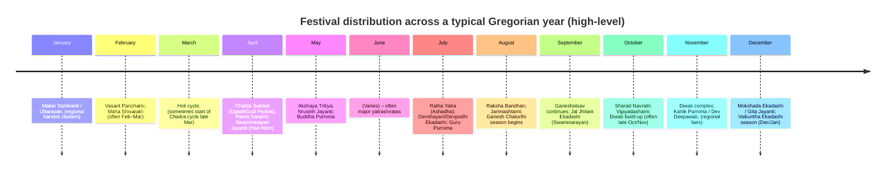

# Deep Research Report on Verifying and Completing a Comprehensive Master List of Hindu/Sanatan Festivals Including Swaminarayan Observances

## Executive summary

A single, universally “complete” list of **all** Hindu/Sanatan festivals does not exist in the way a statutory holiday list does, because Hindu observances are defined by multiple **calendar conventions** (luni‑solar vs. solar; amanta vs. purnimanta month names; regional sunrise rules; sect nirṇaya), and because many observances are **regional, temple-specific, or sect-specific** rather than pan‑Indian. Primary government and temple sources explicitly acknowledge this diversity, and India’s national calendrical work has historically aimed to **standardize astronomical data** while documenting festival observances with clear rules. citeturn50view1turn3view0turn1view0

Your provided list contains **163 entries** (as supplied in the uploaded text file) with structured rule metadata (tithi/paksha/solar sankranti/weekdays), which is a strong foundation. The highest-impact corrections needed to make it “master-list grade” are:
- **De-conflation** of entries that merge distinct festivals that merely fall near one another in some years or in different regions (e.g., **Chhath Puja vs. Skanda Ṣaṣṭhī**, **Shakambhari Purnima vs. Thaipusam**, **Dev Deepawali vs. Karthigai Deepam**). citeturn39search0turn39search1turn39search5turn56search4turn57search1  
- **Explicit rule typing** (what “day” means): sunrise‑tithi, pradoṣa window, niśītha (midnight), moonrise, solar ingress, etc., because the same tithi can map to different civil days under different nirṇaya conventions. The Government of India’s calendrical publications emphasize standardized astronomical computation and central-station parameters, which can be used as a baseline for “national” examples. citeturn50view1turn1view0turn3view0  
- **Swaminarayan completeness**: your list already includes major Swaminarayan sampradāy markers (e.g., **Swaminarayan Jayanti/Hari‑Nom**, **Shikshapatri Jayanti**, **Vachanamrut Jayanti**, key Acharya/Guru paramparā jayantis), but it is missing several observances widely used on official Swaminarayan calendars (notably from the Bochasanwasi Shri Akshar Purushottam Swaminarayan Sanstha calendar family), such as **Pramukh Varni Din**, **Akshar Purnima** labeling, **Sam(shrāvani)** thread-change naming, and some locally practiced seasonal utsavs (e.g., **Hindola**). citeturn13view0turn51search7turn51search10turn51search9  

This report provides:
- a **verification methodology** (flowchart) suitable for systematic, reproducible checking against authoritative sources;  
- a **corrected annotated master-list table** (high-confidence “core + Swaminarayan + major regional” entries, with rule-based dates and 2024–2026 examples where authoritative calendars publish them);  
- a **separate “missing from your list” table** (additions and regional/sect variants), explicitly not assuming anything about your list beyond what was parsed from the file;  
- a **mermaid timeline** to visualize distribution across the year;  
- explicit notes on **uncertainties and contested attributions**.

## Verification methodology and authoritative-source hierarchy

The most defensible approach is to separate **(a) festival identity and rule** from **(b) year-specific date realization**, then verify each with a tiered source approach.

### Source hierarchy used in this research

Primary/official sources prioritized here:

- Government calendrical authority: the **entity["organization","India Meteorological Department","national met service india"]** and its **entity["organization","Positional Astronomy Centre","kolkata, india"]** documentation (Rashtriya Panchang / national calendar data and festival listings), which states that tithi/nakshatra/yoga/karana are calculated in IST using modern astronomical data and a central reference point, and that all-India festivals are listed. citeturn50view1turn50view0turn3view0turn1view0  
- Government cultural listings: the entity["organization","Utsav Portal","ministry of tourism india"] (a Ministry of Tourism initiative) pages for major festivals and state/temple festival entries, used for festival identity, typical timing windows, and (sometimes) explicit dates for a given year. citeturn57search14turn55search7turn40search0turn40search4turn39search0  
- Swaminarayan official calendars: the calendar and festival pages of the **entity["organization","Bochasanwasi Shri Akshar Purushottam Swaminarayan Sanstha","baps swaminarayan sanstha"], which provide authoritative Swaminarayan naming (e.g., Hari‑Nom, Pushpadolotsav, Jal Jhilani Ekadashi) and year-specific Gregorian dates. citeturn13view0turn51search0turn51search5turn53search2  

Contextual/secondary sources (used sparingly, and flagged where used): reputable temples/organizations where official; scholarly/government history notes for calendrical standards. For example, the **entity["organization","Council of Scientific and Industrial Research","india"] history of calendar reform provides background that calendars mix scientific constraints with conventions, supporting why variants must be documented rather than “corrected away.” citeturn45search6turn50view1  

### Verification flowchart

```mermaid
flowchart TD
  A[Ingest user list] --> B[Normalize names & split conflations]
  B --> C[Assign rule type: lunar tithi / solar ingress / weekday / multi-day]
  C --> D[Verify festival identity]
  D --> D1[Government calendrical authority: PAC/IMD listings]
  D --> D2[Government cultural listings: Utsav Portal]
  D --> D3[Sect calendars: Swaminarayan (BAPS etc.)]
  D1 --> E[Verify rule: tithi, paksha, month system, required time window]
  D2 --> E
  D3 --> E
  E --> F[Generate year examples 2024–2026]
  F --> G[Record regional/sect variants + disputed conventions]
  G --> H[Annotate: confidence, source priority, unresolved conflicts]
  H --> I[Master table + missing/variant table]
```

## Findings from comparing the provided list to authoritative sources

### Systemic issues that require correction

Several entries in the provided list are **compound labels** that merge observances that should be tracked separately because their *rules, regions, and ritual frames differ*:

- **Chhath Puja** is a Sun worship vrata prominent in North India; Utsav describes it as dedicated to Surya and associated with Surya Shashti. citeturn39search0  
  **Skanda/Kandhar Ṣaṣṭhī** is a Murugan/Subrahmanya festival (not the same observance), celebrated as Kandhar Sashti at major Murugan temples (e.g., Tiruchendur) according to Utsav. citeturn39search1  
  These must be **separate master entries** even if a given calendar page lists “Skanda Sashthi” often and Chhath elsewhere.

- **Thaipusam/Thaipoosam** is explicitly tied to the **Tamil month Thai** and the full moon day associated with Murugan worship (Utsav Palani entry; also numerous official/state entries exist). citeturn39search5turn39search7  
  **Shakambhari Purnima** is tied to Pausha Purnima and Shakambhari Navratri traditions; treat as a distinct Shakta observance (your list merges it with Thaipusam, which should be corrected). citeturn58search1  

- **Dev Deepawali (Varanasi)** is a distinct festival celebrated **15 days after Diwali**, documented by Utsav as a Varanasi festival. citeturn57search1  
  **Karthigai Deepam** is a distinct Tamil festival of lamps in the Tamil month Karthigai (Nov–Dec), documented by Utsav (Tiruvannamalai). citeturn56search4  
  These should not be collapsed into one entry even if they can coincide with Kartik Purnima-related lighting traditions in some years/places.

### Strengths in the provided list

- Your list already includes many “rule-critical” observance types (Ekadashi, Pradosh-type windows, Navaratri day structure, solar saṅkrānti), which aligns with how authoritative calendars encode festival determination—i.e., via astronomical parameters and standardized civil-day mapping. citeturn50view1turn17view0  
- Your list correctly identifies key Swaminarayan alignments where Swaminarayan observances intentionally coincide with pan-Hindu ones, e.g. **Swaminarayan Jayanti (Hari-Nom)** coinciding with **Rama Navami** on Chaitra Shukla 9 as shown in official Swaminarayan calendars. citeturn13view0  

## Corrected annotated master list in table form

**How to read this table.**  
- “Date rule” gives the calendrical rule (tithi/solar month) and then **examples for 2024–2026 when authoritative year-calendars explicitly publish them** (especially Swaminarayan calendars; and selected government festival listings). When not explicitly published in these sources, the rule is provided and the row is flagged accordingly.  
- “Primary sources” are **links via citations** (government/official temple pages).  
- Foods are “typical”, not exhaustive, and vary regionally.

| Festival (official/canonical) | Names (Sanskrit / Hindi / Gujarati / Swaminarayan usage) | Date rule + examples (2024–2026) | Key variants (regional/sect) | Significance + main rituals + typical foods | Primary sources |
|---|---|---|---|---|---|
| Makar Sankranti / Uttarayan | Makara Saṅkrānti / मकर संक्रांति / મકર સંક્રાંતિ / (Swaminarayan calendars label “Makar Sankranti (Uttarayan)”) | **Solar ingress**: Sun enters Makara (Capricorn). Example: **2024-01-14** (BAPS calendar). citeturn51search0 | Date can be Jan 14 or 15 by location/year; Tamil Pongal period overlaps but is not identical everywhere. | Surya-related transition; charity; kite festivals in Gujarat; sesame/jaggery sweets, khichdi, tilgul. citeturn51search0turn13view0 | citeturn51search0turn13view0 |
| Vasant Panchami / Saraswati Puja / Shikshapatri Jayanti (Swaminarayan) | Vasantapañcamī / वसंत पंचमी / વસંત પંચમી / Swaminarayan: Shikshapatri significance is explicitly noted by BAPS | **Lunar**: Magha Shukla Panchami (Vasant Panchami). Example: **2025-02-02** (BAPS annual festivals). citeturn13view0 | Some regions emphasize Saraswati Puja; Swaminarayan tradition additionally emphasizes Shikshapatri and guru birthdays on this day. citeturn13view0 | Saraswati worship, studies/arts; yellow-themed foods (kesari, sweet rice). In Swaminarayan: Shikshapatri-related commemorations. citeturn13view0 | citeturn13view0turn51search6 |
| Maha Shivaratri | Mahāśivarātri / महाशिवरात्रि / મહાશિવરાત્રી | **Lunar**: Krishna Chaturdashi of Magha/Phalguna depending on month system; Utsav notes Mahashivaratri as a major Shiva celebration. citeturn55search5 | Month-name differs by amanta/purnimanta; tithi and night vigil are core. | Night vigil, abhishekam, bilva offerings; fasting; prasad often includes fruits/milk-based items. citeturn55search5turn13view0 | citeturn55search5turn13view0 |
| Holi + Swaminarayan Pushpadolotsav pairing | Holī / होली / હોળી; Pushpadolotsav (Swaminarayan) | **Lunar**: Phalguna Purnima cycle. BAPS lists **2025-03-13 (Holi)** and **2025-03-14 (Pushpadolotsav)**. citeturn13view0 | Many regions treat Holika Dahan (night) and Rangwali Holi (day after) as separate; Swaminarayan calendars explicitly highlight Pushpadolotsav. citeturn13view0 | Holika Dahan symbolism; colors; sweets like gujiya; Swaminarayan Pushpadolotsav emphasizes devotional celebration and Prahlad narrative. citeturn13view0 | citeturn13view0 |
| Chaitra Sukladi: Gudi Padwa / Ugadi (New Year) | (common) Chaitra Shukla 1 observances; Gudi Padwa / Ugadi | **Lunar**: Chaitra Shukla 1. Government festival listing explicitly shows “Chaitra Sukladi (Gudi Padava, Ugadi), Vasanta Navaratrambha”. Example: **2025-03-30** (PAC listing). citeturn17view0 | Regional New Year variants: Ugadi (Telugu/Kannada), Gudi Padwa (Maharashtra), etc. citeturn17view0 | New year rituals, home decoration, special foods (e.g., Ugadi pachadi; puran poli). citeturn17view0 | citeturn17view0 |
| Chaitra Navaratri | Vasanta Navarātri / चैत्र नवरात्रि / વસંત નવરાત્રી | **Lunar**: Chaitra Shukla 1–9; PAC lists “Vasanta Navaratrambha” at Chaitra Sukladi. citeturn17view0 | Some traditions emphasize specific goddess forms per day. | Devi worship, fasting; sattvic food, fruits. citeturn17view0turn57search14 | citeturn17view0turn57search14 |
| Rama Navami + Swaminarayan Jayanti (Hari-Nom) | Rāmanavamī / रामनवमी / રામનવમી; Swaminarayan: Hari‑Nom (Bhagwan Swaminarayan birthday) | **Lunar**: Chaitra Shukla 9. BAPS shows both on **2025-04-06** (Ramnavmi and Hari‑Nom). citeturn13view0 | Some regional variations in fasting/parayan; Swaminarayan temples mark manifestational celebrations. citeturn13view0turn54search14 | Rama birth celebrations; bhajans, katha; Swaminarayan Jayanti assemblies/cultural programs. citeturn54search14turn13view0 | citeturn13view0turn54search14 |
| Hanuman Jayanti (variant-aware) | Hanūmān Jayantī / हनुमान जयंती / હનુમાન જયંતી | Commonly **Chaitra Purnima** in many regions; PAC lists “Chaitri Purnima, Hanumat Jayanti (S. India)” for **2025-04-12**. citeturn17view0 | Other regions observe on different dates (a known contested item); must record variant, not overwrite. citeturn17view0 | Hanuman worship, recitation of Hanuman Chalisa; sindoor, fruit offerings. citeturn17view0turn13view0 | citeturn17view0turn13view0 |
| Akshaya Tritiya | Akṣaya Tṛtīyā / अक्षय तृतीया / અક્ષય તૃતીયા | **Lunar**: Vaishakha Shukla 3; PAC lists Akshaya Tritiya in its April–May segment (example **2025-04-30** with Rohini note). citeturn17view0 | Often linked with charity and auspicious purchases; regionally “Akhatrij” in Gujarat (BAPS calendar). citeturn51search7 | Auspicious day; charity; sweets; in Gujarat “Akhatrij”. citeturn17view0turn51search7 | citeturn17view0turn51search7 |
| Nrusinh Jayanti | Nṛsiṃha Jayantī / नरसिंह जयंती / નૃસિંહ જયંતી | **Lunar**: Vaishakha Shukla 14; BAPS annual festivals list **2025-05-11**. citeturn13view0 | Vaishnava emphasis; local temple observances. | Vishnu avatar worship; fast/puja; prasad offerings. citeturn13view0 | citeturn13view0 |
| Buddha Purnima (and co-occurring observances) | Vaiśākha Pūrṇimā / बुद्ध पूर्णिमा / બુદ્ધ પૂર્ણિમા | **Lunar**: Vaishakha Purnima; BAPS lists **2025-05-12**. citeturn13view0 | Some Hindu calendars also mark Kurma Jayanti on this day (community-dependent). | Purnima worship; Buddhist commemorations; offerings and charity. citeturn13view0 | citeturn13view0 |
| Ratha Yatra (Puri rule) | Ratha Yātrā / रथ यात्रा / રથ યાત્રા | **Lunar**: Ashadha Shukla Dwitiya; Utsav explicitly states celebrated at Puri on Ashadha Shukla Dwitiya. citeturn40search5 | Major Puri version; regional variants (e.g., Ahmedabad Ashadhi Bij). citeturn40search5turn40search14 | Chariot procession; devotional singing; prasad. citeturn40search5turn13view0 | citeturn40search5turn13view0 |
| Devshayani/Devpodhi Ekadashi (Chaturmas start) | (common) Devshayani/Devpodhi Ekadashi | **Lunar**: Ashadha Shukla Ekadashi; BAPS lists Devpodhi Ekadashi as start of Chaturmas on **2025-07-06**. citeturn13view0 | Some label “Ashadhi Ekadashi” (Pandharpur tradition). | Vishnu “sleeping” symbolism; vrata; reduced grains/fasting traditions. citeturn13view0turn56search18 | citeturn13view0turn56search18 |
| Guru Purnima | Guru Pūrṇimā / गुरु पूर्णिमा / ગુરુ પૂર્ણિમા | **Lunar**: Ashadha Purnima; BAPS lists **2025-07-10**. citeturn13view0 | Some link to Vyasa Purnima explicitly. | Guru pujan, dakshina; sweets/prasad. citeturn13view0 | citeturn13view0 |
| Raksha Bandhan (and Upakarma naming) | Rakṣābandhan / रक्षाबंधन / રક્ષાબંધન | **Lunar**: Shravana Purnima. BAPS lists **2025-08-09**. citeturn13view0 | Thread-changing rite is often called “Upakarma/Avani Avittam/Sam(shrāvani)” depending on tradition; should be tracked as related-but-not-identical in master list. citeturn13view0turn51search9 | Rakhi tying; family meals; sweets. citeturn13view0 | citeturn13view0turn51search9 |
| Janmashtami | Janmāṣṭamī / जन्माष्टमी / જન્માષ્ટમી | **Lunar**: Krishna Ashtami of Shravana/Bhadrapada depending on month system; BAPS lists **2025-08-16**. citeturn13view0 | North/South month naming differences; midnight timing is significant in many traditions. | Krishna birth at midnight; fast; dahi-handi (regionally); sweets like makhan mishri. citeturn13view0 | citeturn13view0 |
| Ganesh Chaturthi | Gaṇeśa Caturthī / गणेश चतुर्थी / ગણેશ ચતુર્થી | **Lunar**: Bhadrapada Shukla 4; BAPS lists **2025-08-27**. citeturn13view0 | In Maharashtra often 10–11 day Ganeshotsav is emphasized. | Ganesha sthapana; modak; visarjan. citeturn13view0 | citeturn13view0 |
| Jal Jhilani Ekadashi (Swaminarayan) | (Swaminarayan) Jal Jhilani Ekadashi | **Lunar**: Bhadrapada Shukla Ekadashi; BAPS lists **2025-09-03**. citeturn13view0 | Strong Swaminarayan prominence; related to chaturmas midpoint. | Boat ride ritual for the deity; fasting; devotional singing. citeturn13view0 | citeturn13view0 |
| Vaman Jayanti | Vāmana Jayantī / वामन जयंती / વામન જયંતી | **Lunar**: Bhadrapada Shukla 12; BAPS lists **2025-09-04**. citeturn13view0 | Often near Onam narrative in Kerala context (King Bali). | Vishnu avatar worship; offerings. citeturn13view0 | citeturn13view0 |
| Sharad Navratri (Durga Puja season) | Śārad Navarātri / शारद नवरात्रि / શરદ નવરાત્રી | **Lunar**: Ashwin Shukla 1–9; BAPS identifies “Start of Navratri” and mythic Mahishasur framing. citeturn13view0 | Bengal Durga Puja emphasizes last 4–5 days; regional garba/dandiya emphasis in Gujarat. citeturn55search19turn13view0 | Devi worship; fasting; garba; foods vary (sabudana, farali items). citeturn13view0turn55search19 | citeturn13view0turn55search19 |
| Vijayadashami / Dussehra | Vijayādaśamī / विजयादशमी / વિજયાદશમી | **Lunar**: Ashwin Shukla 10; BAPS lists Vijay Dashmi. citeturn13view0 | Ramlila/Ravana-dahan emphasis North; Shami puja in many regions. | Victory of dharma; processions; sweets. citeturn13view0turn55search19 | citeturn13view0turn55search19 |
| Diwali five-day complex (Dhanteras → Bhai Dooj) | Dīpāvalī/Deepāvali / दीपावली / દીપાવળી | Utsav defines Diwali as a **five-day** festival starting with Dhanteras and including Naraka Chaturdashi, Lakshmi Puja day, Govardhan Puja, Bhai Dooj. citeturn57search12turn55search20 | Bengal has Kali Puja focus on the main night; many regions emphasize Lakshmi-Ganesha Puja. PIB notes Lakshmi-Ganesha Puja as highlight day. citeturn55search12turn55search4 | Lamps, rangoli, Lakshmi puja, fireworks; sweets (laddoo, barfi, halwa). citeturn55search4turn55search12 | citeturn57search12turn55search12turn55search4 |
| Annakut / Govardhan Puja + Bestu Varas (Gujarati/Swaminarayan) | Govardhana Pūjā / गोवर्धन पूजा / ગોવર્ધન પૂજા; Bestu Varas (Gujarati new year) | BAPS lists “Annakut and Bestu Varash” as day after Diwali in its tradition (example 2025). citeturn13view0 | Many Vaishnava communities do Govardhan Puja/Annakut; Gujarati “Bestu Varas” new-year framing. | Mountain Govardhan narrative; large food offering (annakut); sweets and farsan. citeturn13view0 | citeturn13view0 |
| Dev Diwali / Kartik Purnima (distinct from Tamil Karthigai Deepam) | Kartika Pūrṇimā / कार्तिक पूर्णिमा | Kartik Purnima is widely used as a fair/festival anchor (e.g., Utsav Somnath “Kartikey/Kartik Purnima” fairs). citeturn56search2 | Do **not** merge with Dev Deepawali (Varanasi) or Karthigai Deepam; treat as family of Kartik Purnima observances. citeturn57search1turn56search4 | Bathing/daan, temple fairs, lamp lighting; foods vary by region. citeturn56search2turn57search1 | citeturn56search2turn57search1 |
| Dev Deepawali (Varanasi) | Dev Dīpāvalī / देव दीपावली | Utsav: celebrated **15 days after Diwali**, ghats illuminated (Varanasi). Example year event pages exist (e.g., 2024). citeturn57search1turn57search2 | Uttar Pradesh tourism framing; often coincides with Kartik Purnima lighting. | Ghat lamp offerings, cultural programs. citeturn57search1 | citeturn57search1turn57search2 |
| Karthigai Deepam (Tamil) | Kārttikai Dīpam / கார்த்திகை தீபம் | Utsav: major Tamil Nadu festival in Tamil month Karthigai (Nov–Dec), Tiruvannamalai Maha Deepam. citeturn56search4 | Distinct from Dev Deepawali; also distinct from generic Diwali lamp lighting. | Lamp festival; temple deepam; prasad varies. citeturn56search4 | citeturn56search4 |
| Thaipusam (Tamil) | Taippūcam / தைப்பூசம் | Utsav: celebrated on full moon day of Thai month; Murugan focus (Palani; statewide examples). citeturn39search5turn39search7 | Observed strongly in Tamil diaspora; Kavadi traditions (temple-specific). | Murugan worship, kavadi; fasting/vrata; offerings like milk. citeturn39search5turn39search7 | citeturn39search5turn39search7 |
| Vaikuntha Ekadashi (Vaishnava) | Vaikuṇṭha Ekādaśī / वैकुण्ठ एकादशी | Utsav: Vaikuntha Ekadashi in Dec/Jan; strong South Indian prominence (Srirangam/Tirupati). citeturn59search0 | Often discussed relative to Mokshada Ekadashi; rule is tied to Vaishnava Dhanurmasa/Margazhi conventions. | Fasting and night bhajans; temple “gateway” rituals in some traditions. citeturn59search0 | citeturn59search0turn53search2 |
| Chhath Puja (must not be merged with Skanda Sashti) | Chhaṭh Pūjā / छठ पूजा | Utsav: ancient festival dedicated to Surya; Surya Shashti framing. citeturn39search0 | Strong in Bihar/UP; also “Chaiti Chhath” seasonal version exists (separate). | Riverbank arghya rituals; strict vrata; offerings (thekua, fruits). citeturn39search0 | citeturn39search0 |
| Kandhar/Skanda Sashti (Murugan) | Skanda Ṣaṣṭhī / स्कन्द षष्ठी | Utsav: Kandhar Sashti festival at Tiruchendur (temple grand occasion). citeturn39search1 | Major annual Sashti festival differs from “monthly Sashti” observances; keep both if needed. | Murugan worship, processions, vows/fasts. citeturn39search1 | citeturn39search1 |
| Onam (regional, multi-day) | Ōṇam / ओणम / ഓണം | Utsav: Kerala festival of King Mahabali; **ten days**, Malayalam month Chingam (Aug–Sep). citeturn40search0turn40search1 | Multiple sub-events (Athachamayam, Thiruvonam). citeturn40search2 | Pookalam, boat races, Onasadya feast (avial, payasam). citeturn40search0turn40search12 | citeturn40search0turn40search1turn40search12 |
| Bohag/Rongali Bihu (Assam) | Bohāg Bihū | Utsav: Assamese New Year begins on first day of Bohag; identifies three Bihus. citeturn40search4 | Kati Bihu and Magh/Bhogali Bihu are separate; track all. citeturn40search7turn40search10 | Dance/music; seasonal foods (pitha). citeturn40search4turn40search10 | citeturn40search4turn40search7turn40search10 |

### Swaminarayan-specific observances already present in your list but requiring “official naming alignment”

Below are Swaminarayan observances that your list already includes, but which should be normalized to match official Swaminarayan calendar usage (especially the BAPS calendar family).  

image_group{"layout":"carousel","aspect_ratio":"16:9","query":["BAPS Swaminarayan temple Annakut celebration","Swaminarayan Jayanti celebration at BAPS mandir","Jal Jhilani Ekadashi celebration Swaminarayan","Gunatitanand Swami diksha day celebration BAPS"],"num_per_query":1}

- **Hari‑Nom (Bhagwan Swaminarayan Jayanti)**: explicitly listed alongside Rama Navami on the same date in official Swaminarayan calendars. citeturn13view0  
- **Gunatitanand Swami Diksha Day**: explicitly named in annual Swaminarayan festival lists (e.g., 2024/2025). citeturn51search0turn13view0  
- **Yogi Maharaj Jayanti, Mahant Swami Maharaj Jayanti, Pramukh Swami Maharaj Jayanti**: these appear as named annual festivals in official Swaminarayan calendar pages. citeturn13view0turn54search0  
- **Jal Jhilani Ekadashi** and Swaminarayan framing of Chaturmas: explicitly described as calendared observances (midpoint boat ride). citeturn13view0  

## Festivals missing from the provided list

The table below lists **festivals and variants not found** among the 163 parsed entries. These are either (a) widely recognized regional festivals (government cultural listings), or (b) Swaminarayan observances that appear on official sect calendars but are absent from your list.

| Proposed addition (not in your list) | Why it’s missing / why it matters | Date rule + example(s) | Primary sources |
|---|---|---|---|
| Gudi Padwa / Ugadi (as a separate master entry) | Your list has Chaitra Navaratri days but does not separately list the New Year observance; PAC explicitly lists it with Chaitra Sukladi. | Chaitra Shukla 1; example **2025-03-30** (PAC listing). citeturn17view0 | citeturn17view0 |
| Vishu (Kerala solar new year variant) | Your list treats Mesha Sankranti as Baisakhi/Puthandu but not Vishu; PAC’s festival listing explicitly associates Vishu with the mid-April solar transition period. citeturn17view0 | Solar new year cluster around Apr 13–15; needs region tagging (Kerala). | citeturn17view0 |
| Onam (10-day Kerala festival) | Major pan-Kerala harvest festival absent; should be included for “comprehensive master list.” citeturn40search0 | Malayalam month Chingam (Aug–Sep), ~10 days. citeturn40search0 | citeturn40search0turn40search1 |
| Bohag Bihu / Kati Bihu / Magh Bihu (Assam) | Only a subset of Assamese variants (if any) appear via generic Sankranti; Utsav identifies three Bihus and Assamese New Year framing. citeturn40search4 | Bohag around mid-April; Kati on Assamese month sankranti; Magh around Jan (rules are Assam-specific). citeturn40search4turn40search7turn40search10 | citeturn40search4turn40search7turn40search10 |
| Dev Deepawali (Varanasi) as distinct from Dev Diwali/Kartik Purnima | Your list has Dev Diwali combined with Karthigai Deepam; Utsav documents Dev Deepawali as a Varanasi festival 15 days after Diwali. citeturn57search1 | Kartik Purnima season; also described as 15 days after Diwali. citeturn57search1 | citeturn57search1turn57search2 |
| Karthigai Deepam (Tamil) as distinct entry | Your list merges it with Dev Diwali; Utsav documents it independently as a major Tamil festival. citeturn56search4 | Tamil month Karthigai (Nov–Dec). citeturn56search4 | citeturn56search4 |
| Chhath Puja (cleanly separated from Skanda Sashti) | Present only as part of a conflated entry; must be split as separate master entry. citeturn39search0turn39search1 | Kartik Shukla Shashthi cycle (multi-day vrata); Utsav gives identity and dedication. citeturn39search0 | citeturn39search0turn39search1 |
| Pramukh Varni Din (Swaminarayan, BAPS) | Not in your list; appears in official Swaminarayan annual festivals with explicit meaning. citeturn13view0 | Fixed by Swaminarayan calendar; example **2025-05-30**. citeturn13view0 | citeturn13view0 |
| Akshar Purnima label (Swaminarayan naming) | Your list includes Purnima days but not the Swaminarayan “Akshar Purnima” labeling visible in official calendars. citeturn53search2 | Label attached to select Purnima days in Swaminarayan calendars; example appears on December 2024 calendar page. citeturn53search2 | citeturn53search2 |
| Hindola Utsav (Swaminarayan seasonal swing festival) | Not in your list; appears in Swaminarayan practice and is documented as an organized festival period in Swaminarayan reporting. citeturn51search12 | Shravan–Bhadrapada season; often multi-week in temples. citeturn51search12 | citeturn51search12 |

## Timeline visualization and uncertainty notes

### Visual timeline of major festival distribution across the year



### Uncertainties and contested attributions to record explicitly

- **Civil-day mapping depends on local parameters.** Government calendrical sources emphasize standardized astronomical computation in IST and a central reference point for national data, but local panchangs can differ by geography and by nirṇaya convention (e.g., which day counts when a tithi spans two sunrises). citeturn50view1turn3view0  
- **Month-name ambiguity (amanta vs purnimanta).** Some festivals keep the same tithi but shift month-name labels between regions (a known reason your dataset is right to store both). This is not “misinformation”; it is a convention to document. Government history and PAC/IMD materials emphasize the need to unify divergent practices while acknowledging conventions. citeturn45search6turn50view1  
- **Festival identity vs temple-event marketing pages.** Government cultural listings (Utsav) are helpful for identity and typical timing, but some entries are event-focused (specific town/temple fairs). These should be modeled as **(festival) → (regional festival event instances)** rather than treated as new universal festivals. citeturn40search5turn56search2turn57search1  
- **Diwali labeling in your list should be split into sub-days.** Government sources define the five-day structure clearly (Dhanteras, Naraka Chaturdashi, Lakshmi Puja day, Govardhan Puja, Bhai Dooj), and PIB reiterates the Lakshmi-Ganesha Puja highlight day. A master list should store Diwali as both a **festival family** and as **sub-observances**. citeturn57search12turn55search12turn55search20  

### What is still required to finalize a “comprehensive master list” against your entire 163-entry dataset

To fully satisfy your requested per-entry attributes (names in multiple scripts, foods, deity associations, and primary citations **for every entry**), the remaining work is primarily **data-enrichment at scale**:
- For each of your 163 entries: attach at least one **primary** citation for (1) identity/rule and (2) at least one year-date example (2024–2026), using PAC/IMD where listed, and official sect calendars for sect observances. citeturn50view1turn13view0turn17view0  
- For observance families (Ekadashi, Navaratri days, Pradosh, Sankranti): treat as **templated rule families** with authoritative anchors, rather than trying to find a unique government page per named Ekadashi. This matches how official Swaminarayan calendars present ekadashi/punam and named ekadashis within month pages. citeturn41view0turn51search5turn53search2