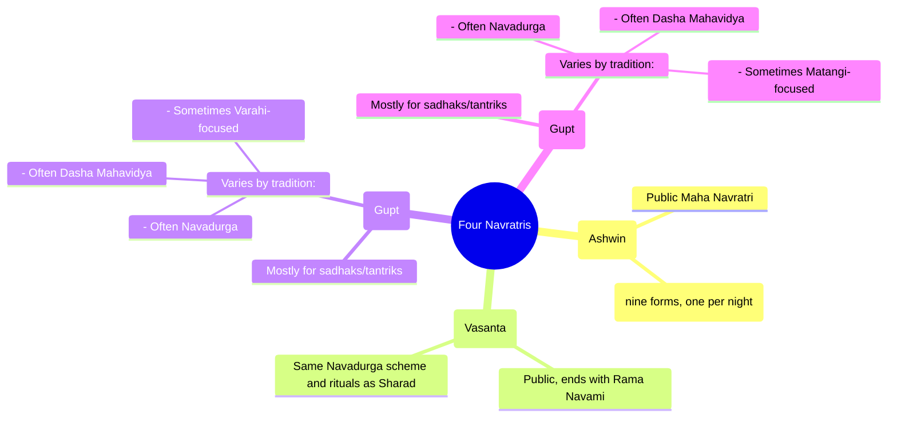

Short answer:  
- For Sharad Navratri (Ashwin) and Chaitra Navratri, there is a very popular scheme where each of the nine nights is linked to a named form of Durga (the Navadurgā).  
- For the “Gupt” Navrātris of Ashādha and Māgha, there is **no universally fixed “one form per night” list**. In practice, many traditions either:  
  - use the **same Navadurgā list**, or  
  - worship a **different set** (for example, the 10 Mahāvidyās, or special forms like Vārāhī or Mātaṅgī).

So the idea that “each ratri has a dedicated Devi” applies cleanly to the **major, publicly celebrated Navrātris**, but only **locally/traditionally** to the Gupt ones.

---

## 1. What are the “four Navrātris”?

Traditional panchānga and ritual sites list four Navrātri periods in the year:

- Chaitra Navratri (Vasanta Navratri) – March–April; ends with Rāma Navamī  
- Sharad Navratri (Maha Navratri) – September–October; leads to Vijayādaśamī  
- Magha (Māgha) Gupt Navratri – January–February  
- Ashadha Gupt Navratri – June–July  

This fourfold scheme is widely mentioned by Hindu calendars and spiritual sites.【turn12fetch0】【turn10find0】

---

## 2. The “nine forms per night” idea – where does it come from?

For **Sharad** and **Chaitra**, the popular practice is:

- Navratri = nine nights,  
- each night/day dedicated to one of the **Navadurgā** forms of Durgā.

This list is:

1) Śailaputrī  
2) Brāhmacāriṇī  
3) Caṇḍraghaṇṭā  
4) Kuṣhmāṇḍā  
5) Skandamātā  
6) Kātyāyanī  
7) Kālarātrī  
8) Mahāgaurī  
9) Siddhidātrī  

These names appear in the **Devi‑kavacha**, a hymn traditionally recited before the Devī Māhātmya (Durga Saptashati) during Navarātra; the article on the nine names of Durgā clearly states this and lists them.【turn8fetch0】  
Modern guides and panchāngas routinely use this list for both **Sharad** and **Chaitra** Navratri (day‑wise puja, colours, offerings, etc.).【turn1search5】【turn3search0】

Drik Panchang explicitly notes for **Chaitra Navratri**:

- “All nine days during Navratri are dedicated to nine forms of Goddess Shakti. Most customs and rituals followed during Shardiya Navratri … are also followed during Chaitra Navratri.”【turn7find2】

So, for **Sharad** and **Chaitra**, you can reasonably say:  
“Yes – there is a widely accepted ‘dedicated Devi for each ratri’ list (the Navadurgās).”

---

## 3. What about Ashādha and Māgha (Gupt Navrātris)?

Here the situation is different:

- Ashādha and Māgha are known as **Gupt Navratri** (“hidden” Navratri) and are observed more by ascetics, tantriks and serious sādhakas rather than as big public festivals.【turn10find0】【turn12fetch0】

- There is **no single, universal “one Devi per night” list** for these in mainstream smārta scriptures. Instead, practice varies by **sampradāya and region**:

  1) Some **do use the same Navadurgā set**  
     - Many popular articles describe Ashādha Navratri as “nine days and nights dedicated to the nine forms of Shakti (Mother Goddess)”, and then outline rituals without specifying a different list, implicitly or explicitly re‑using the Navadurgā framework.【turn12fetch0】

  2) Many **Tantric traditions focus on the Daśa Mahāvidyās (10 Great Wisdom Goddesses)** instead  
     - Articles on Gupt Navratri explicitly say that the Daśa Mahāvidyās—Kālī, Tārā, Tripurasundarī (Śoḍaśī), Bhuvaneśvarī, Bhairavī, Chinnamastā, Dhūmavatī, Bagalāmukhī, Mātaṅgī, Kamalā—are the primary focus during Gupt Navratri (Māgha and Ashādha).【turn10find0】【turn12fetch0】  
     - This is a **different set** from the standard nine Durgās.

  3) Some specialise further (regional/sectarian emphasis)  
     - Ashādha Navratri is also called **Vārāhī Navratri** in many texts; Vārāhī (a Mātṛkā and also a Mahāvidyā) is given special importance.【turn12fetch0】  
     - Māgha Navratri is sometimes called **Mātaṅgī Navratri**, focusing on Goddess Mātaṅgī, one of the Daśa Mahāvidyās.【turn9fetch1】

Because of this diversity, it would be wrong to say:  
“Magha and Ashadha Navratris have a fixed, scripturally mandated Devi for each night, the same way Sharad/Chaitra do.”

Instead, what is true is:

- **Structurally**, even Gupt Navratri are still “nine nights of Devi” and many texts still speak of “nine forms” in a generic sense.【turn12fetch0】  
- **Specifically**, the set of forms and the mapping (which night → which Devi) depends on the tradition (Navadurgā vs Daśa Mahāvidyā vs a particular ishṭa like Vārāhī/Mātaṅgī).

---

## 4. So, does “every ratri in all four Navrātris have a dedicated Devi”?

Putting it all together:

- **Sharad Navratri (Ashwin)**  
  - Widely followed “one form per night” scheme: the **Navadurgā** list is the standard across most of India.【turn8fetch0】【turn1search5】

- **Chaitra Navratri (Vasanta)**  
  - Same Navadurgā list and very similar rituals as Sharad; authoritative panchānga sites explicitly say this.【turn7find2】

- **Ashādha & Māgha (Gupt) Navrātris**  
  - Concept: still “nine nights of the Goddess.”  
  - In practice:  
    - Some continue with the **Navadurgā** scheme.  
    - Many tantrik groups instead emphasize the **Daśa Mahāvidyās** or other specific forms (Vārāhī, Mātaṅgī, etc.).【turn10find0】【turn12fetch0】【turn9fetch1】  
  - There is **no one, universal “Devi per night” table** for these two the way there is for Sharad/Chaitra.

So the precise answer to your question:

- If you mean:  
  “Is there a single, widely accepted scheme that gives a fixed Devi for each of the nine nights in **all four** seasonal Navrātris?”  
  → **No**, especially for the Gupt Navrātris.

- If you mean:  
  “Do scriptures or traditions connect each night of Navratri to a specific form of the Goddess?”  
  → **Yes** for **Sharad** and **Chaitra** (Navadurgā);  
  → **It varies by tradition** for **Ashādha** and **Māgha**, where multiple schemes (Navadurgā, Daśa Mahāvidyā, special forms like Vārāhī/Mātaṅgī) are used, but none of them is universally fixed across all Hindus.

---

## 5. Quick visual summary

---

### Bottom line

- The “one dedicated Devi for each ratri” idea is **firmly established for Sharad and Chaitra Navratri** (the Navadurgā scheme).  
- For **Ashādha and Māgha (Gupt) Navratri**, many traditions do indeed worship a set of nine (or ten) forms over nine nights, but **which set** and **which night is for which form** is **not uniform** and can differ widely (Navadurgā, Daśa Mahāvidyā, or specific ishṭa devatās like Vārāhī or Mātaṅgī).